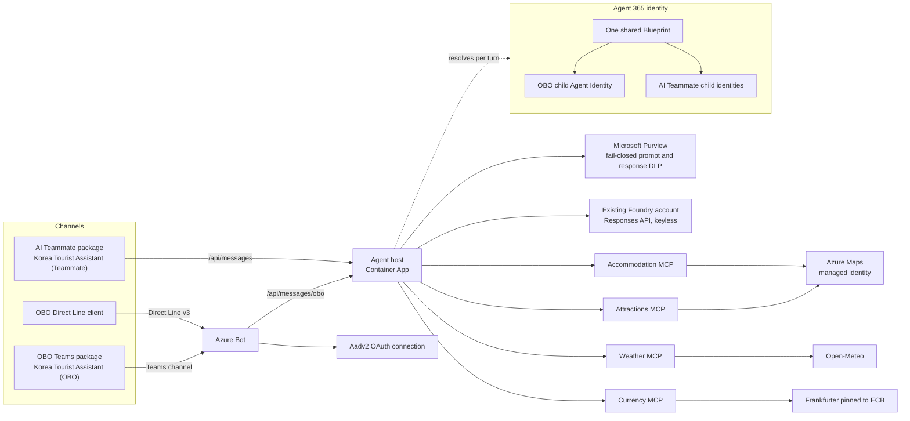
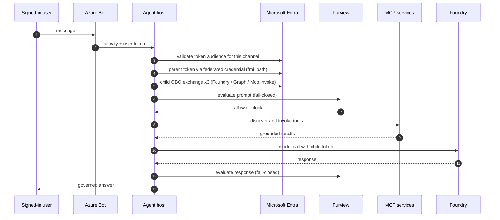
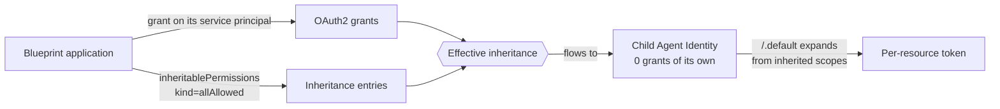

# Korea Tourist Assistant

A governed Microsoft agent that plans trips to South Korea using live weather, places, and
exchange-rate data — built the way an enterprise deployment has to be built, not the way a demo is.

One shared C# backend serves three channels: an on-behalf-of Teams app, a Direct Line console client,
and a Microsoft 365 AI Teammate. Microsoft Agent Framework owns orchestration, Agent 365 owns runtime
identity and transport, Microsoft Purview protects prompt and response content fail-closed, and Korea
travel data is served by four independently deployed MCP services.

> A sibling repository, **`japan-tourist-agent`**, is the same architecture for Japan with different
> data providers. Either one is a complete, standalone reference.

## What is actually guaranteed here

- **No API key in the inference path.** The host authenticates to Microsoft Foundry with a token
  bound to an Agent 365 child identity, resolved fresh on every turn.
- **The agent acts as the signed-in user.** Three separate on-behalf-of exchanges per turn: Foundry,
  Microsoft Graph, and the private MCP API.
- **Fail-closed data protection.** If Purview cannot evaluate a prompt or response, the turn is
  rejected rather than allowed through unevaluated.
- **The infrastructure identity is deliberately powerless.** The host managed identity holds
  `AcrPull` and nothing else — no Foundry, Purview, or MCP data permission.
- **Tools are services, not functions.** Four MCP servers on internal ingress, each requiring a
  delegated `Mcp.Invoke` token.

## Architecture



Active providers need **no API keys**: Azure Maps uses managed identity, Open-Meteo and
Frankfurter/ECB are free public APIs. Korea Eximbank, ForexRateAPI, OpenWeather, and a KTO TourAPI
adapter are compiled and tested but not wired into the active deployment.

## One turn, end to end



Every step is enforced. A failure anywhere fails the turn rather than degrading it.

## Projects and routes

| Project | Owns | Backend route |
| --- | --- | --- |
| [`a365-tourist-backend`](a365-tourist-backend) | Runtime, MCP services, infrastructure, tests, tools, deployment | `/api/messages`, `/api/messages/obo` |
| [`a365-tourist-agent-obo`](a365-tourist-agent-obo) | Teams package source and contract pin | `/api/messages/obo` |
| [`a365-tourist-agent-obo-directline`](a365-tourist-agent-obo-directline) | Console client for testing without Teams | `/api/messages/obo` |
| [`a365-tourist-agent-teammate`](a365-tourist-agent-teammate) | Microsoft 365 AI Teammate package | `/api/messages` |

The two protected host modes share one Blueprint and one deployed backend, but keep separate child
Agent Identities, token audiences, packages, and session state:

| Mode | Route | Audience configuration | Identity binding |
| --- | --- | --- | --- |
| `agentic-user` | `/api/messages` | `TokenValidation__Audiences__AgenticUser` | `dynamic-child-agent-identity` |
| `on-behalf-of` | `/api/messages/obo` | `TokenValidation__Audiences__OnBehalfOf` | `configured-obo-child-agent-identity` |

Teams and Direct Line both reach `/api/messages/obo`, so they share DLP behaviour — but each records
its own acceptance evidence, because the channel, package installation, and token acquisition paths
differ.

## Prerequisites

| Requirement | Notes |
| --- | --- |
| .NET SDK | Pinned in `global.json`; the exact feature band is required |
| Azure subscription | Contributor on the target resource group |
| Entra roles | Agent ID Developer for the Blueprint; Global Administrator for tenant-wide consent |
| `a365` CLI | Blueprint, identity, permissions, packaging |
| `az` CLI | With the Bicep extension |
| Microsoft Foundry | Existing account with a chat-capable model deployment |
| PowerShell 7+ | The validation tools are PowerShell |

You can build, test, and read everything offline. Only live deployment needs a tenant.

## Quick start

```powershell
cd a365-tourist-backend
./tools/Invoke-LocalCi.ps1 -Strict     # build, tests, local host and MCP health probes
./tools/Test-Repository.ps1 -Strict    # architecture and security boundary checks
```

Both should pass before you change anything. `Invoke-LocalCi.ps1` runs 11 gates: tool self-test,
build, solution tests, three host health probes, four MCP health probes, and process cleanup. The
backend builds with 0 warnings and 0 errors under `TreatWarningsAsErrors`.

Readiness reporting `degraded` locally is expected: the sample uses process-local session storage, so
the host declares itself unsafe to scale out.

## Deploy

The full runbook is [`a365-tourist-backend/infra/README.md`](a365-tourist-backend/infra/README.md).
The shape of it:

1. **Create the resource group.** The templates never create it and refuse to deploy anywhere else.
2. **Deploy infrastructure** on placeholder images — registry, Container Apps environment, managed
   identities, Log Analytics, Application Insights, and the MCP API application.
3. **Build and push images** with `az acr build`, then redeploy by digest. Deployments reference
   digests, never mutable tags.
4. **Create the Agent 365 identity** with `a365 setup all` from the owning frontend project.
5. **Complete the Entra wiring.** This is outside the templates and is the step most often missed —
   see below.
6. **Deploy the bot phase** and build the channel packages.

### The Entra wiring that no template can do for you

A child Agent Identity holds **no OAuth2 grants of its own**. It inherits them from the Blueprint, so
every resource a turn calls needs *both* a grant on the Blueprint service principal **and** an
`inheritablePermissions` entry at `kind=allAllowed`.



`a365 setup all` configures only the first-party resources it knows about. It does **not** cover
Azure Machine Learning (the Foundry audience), this backend's custom MCP API, or the Purview Graph
scopes. Without those, `/.default` expands to an empty scope set, Entra returns `AADSTS65001`, and
every turn fails at `identity.resolve` — even though the portal shows a valid-looking grant.

```powershell
a365 query-entra inheritance   # every resource must report "Effective inheritance: OK"
```

Never repair consent with `az ad app permission admin-consent`; it replaces the Blueprint's entire
grant set rather than adding to it.

## Contract alignment

[`a365-tourist-backend/contracts/frontend-backend-contract.json`](a365-tourist-backend/contracts/frontend-backend-contract.json)
is the authoritative non-secret integration contract — `contractId: korea-expert-shared-backend`,
`contractVersion: 2.0.0`. It declares both frontend bindings, the three health endpoints
(`/api/health`, `/api/health/live`, `/api/health/ready`), and the MCP boundary: four services,
streamable-HTTP transport, delegated `Mcp.Invoke` authorization.

Each frontend repeats its matching subset in a committed `backend-contract.lock.json`. Unlike the
generated Agent 365 state around them, these lock files **are** non-secret source and belong in
version control. `contract-alignment-ci.yml` compares all three against the backend contract and
fails the build on any drift.

## Continuous integration

Five workflows in [.github/workflows](.github/workflows), all `windows-latest` with
`permissions: contents: read` and no cloud login:

| Workflow | Timeout | Scope |
| --- | --- | --- |
| `backend-ci.yml` | 25 min | Pinned .NET SDK, then full backend local CI in Release |
| `ai-teammate-ci.yml` | 10 min | AI Teammate contract pin |
| `obo-teams-ci.yml` | 10 min | OBO Teams contract pin |
| `direct-line-ci.yml` | 10 min | Direct Line build, tests, and committed-credential rejection |
| `contract-alignment-ci.yml` | 5 min | Cross-project contract equality |

## Validate

```powershell
cd a365-tourist-backend
./tools/Invoke-LocalCi.ps1 -OutputFormat Json
./tools/Test-Repository.ps1 -Strict -OutputFormat Json

cd ../a365-tourist-agent-obo-directline
dotnet test KoreaExpert.OBO.DirectLine.slnx --configuration Release
```

`Test-Repository.ps1` is worth reading even if you never run it. It enforces the architecture rather
than describing it: the two-stage child identity exchange, per-resource token binding, the MCP token
audience boundary, canonical MCP schema fingerprints, fail-closed Purview, HTTPS-only MCP endpoints
in non-local configurations, and committed-secret hygiene.

## Secrets and safety

No secret is committed. Client secrets, tenant and subscription identifiers, and generated Agent 365
state are produced at deployment time and excluded by `.gitignore`. Documentation uses placeholders
such as `<tenant-id>`; the validation suite fails the build if a real identifier is committed. See
[SECURITY.md](SECURITY.md).

## License

[MIT](LICENSE).
