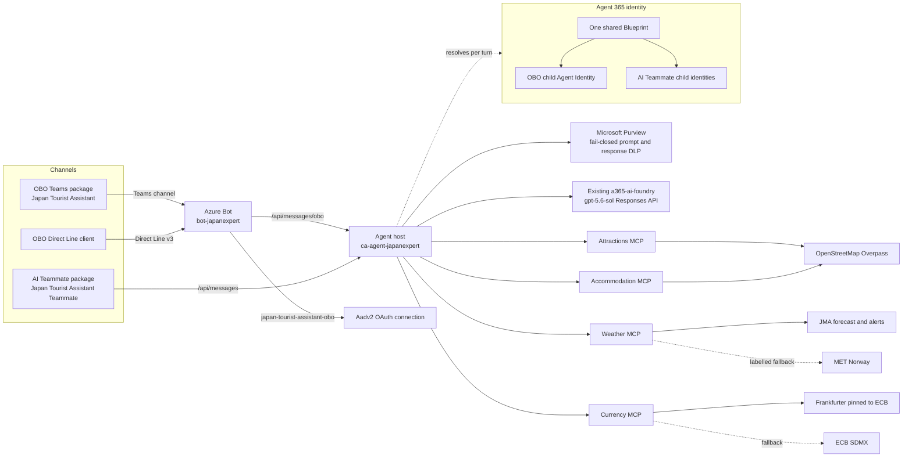
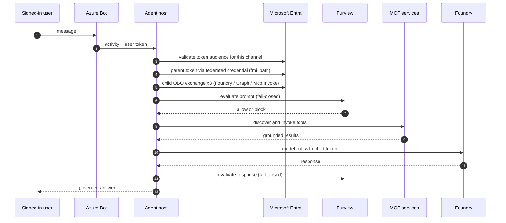
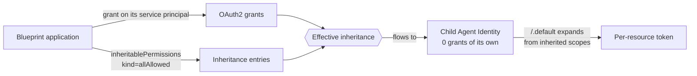

# Japan Tourist Assistant

A governed Microsoft agent that plans trips to Japan using live weather, places, and exchange-rate
data — built the way an enterprise deployment has to be built, not the way a demo is.

One shared C# backend serves three channels: an OBO Teams app, an OBO Direct Line console client, and
a Microsoft 365 AI Teammate. Microsoft Agent Framework owns orchestration, Agent 365 owns runtime
identity and transport, Microsoft Purview protects prompt and response content fail-closed, and Japan
travel data is served by four independently deployed MCP services.

The backend is deployed once. Each frontend owns only its channel contract, package or client, and
acceptance evidence. No frontend contains backend code.

> A sibling repository, **`korea-tourist-agent`**, is the same architecture for South Korea with
> different data providers. Either one is a complete, standalone reference.

## What is actually guaranteed here

- **No API key in the inference path.** The host authenticates to Microsoft Foundry with a token
  bound to an Agent 365 child identity, resolved fresh on every turn.
- **The agent acts as the signed-in user.** Three separate on-behalf-of exchanges per turn: Foundry,
  Microsoft Graph, and the private MCP API.
- **Fail-closed data protection.** If Purview cannot evaluate a prompt or response, the turn is
  rejected rather than allowed through unevaluated.
- **The infrastructure identity is deliberately powerless.** The host managed identity holds
  `AcrPull` and nothing else — no Foundry, Purview, or MCP data permission.
- **Tools are services, not functions.** Four MCP servers on internal ingress, each requiring a
  delegated `Mcp.Invoke` token.

## Status

Rebuilt on 2026-09-01 into the shared resource group `rg-a365-custom-agents` in `koreacentral`,
alongside Korea Tourist Assistant. Every resource name is suffixed `japanexpert`, so the two products
co-exist in one group without collision.

| Channel | Route | Status |
| --- | --- | --- |
| OBO Teams | `/api/messages/obo` | Live and accepted in Microsoft Teams |
| OBO Direct Line | `/api/messages/obo` | Live; bot responds and completes sign-in |
| AI Teammate | `/api/messages` | Package built; awaiting Microsoft 365 licensing, upload, and install |

The host and all four MCP services are on revision `0000001` and healthy, `a365 query-entra
inheritance` reports 7 of 7 resources effective, and both federated identity credentials point at the
rebuilt host managed identity. A governed Teams turn completes Agent Identity resolution with
`child=False, user=True` on the delegated Foundry exchange, fail-closed Purview evaluation, all four
MCP discovery calls, and the Foundry model call. Agent 365 observability export returns HTTP 200,
and the interval carries zero `JEX-` failures. AI Teammate acceptance is still open because no live
AI Teammate turn has run.

## Architecture



Only the agent host has external ingress. The four MCP apps use internal ingress and validate the
shared delegated `Mcp.Invoke` scope. Every MCP data source is a credential-free public HTTPS API, so
no workload holds a data-plane role or reads a provider secret.

## One turn, end to end



Every step is enforced. A failure anywhere fails the turn rather than degrading it.

## Prerequisites

| Requirement | Notes |
| --- | --- |
| .NET SDK | Pinned in `global.json`; the exact feature band is required |
| Azure subscription | Contributor on the target resource group |
| Entra roles | Agent ID Developer for the Blueprint; Global Administrator for tenant-wide consent |
| `a365` CLI | Blueprint, identity, permissions, packaging |
| `az` CLI | With the Bicep extension |
| Microsoft Foundry | Existing account with a chat-capable model deployment |
| PowerShell 7+ | The validation tools are PowerShell |

You can build, test, and read everything offline. Only live deployment needs a tenant.

## Quick start

```powershell
cd a365-tourist-backend
./tools/Invoke-LocalCi.ps1 -Strict     # build, tests, local host and MCP health probes
./tools/Test-Repository.ps1 -Strict    # architecture and security boundary checks
```

Both should pass before you change anything. Readiness reporting `degraded` locally is expected: the
sample uses process-local session storage, so the host declares itself unsafe to scale out.

## Projects and ownership

| Project | Owns | Backend route |
| --- | --- | --- |
| [`a365-tourist-backend`](a365-tourist-backend/README.md) | Shared runtime, MCP services, integrations, infrastructure, Docker assets, tests, tools, deployment | `/api/messages`, `/api/messages/obo` |
| [`a365-tourist-agent-obo`](a365-tourist-agent-obo/README.md) | OBO Teams package source and protected OBO CLI state | `/api/messages/obo` |
| [`a365-tourist-agent-obo-directline`](a365-tourist-agent-obo-directline/README.md) | Direct Line console client, focused tests, synthetic SIT list | `/api/messages/obo` |
| [`a365-tourist-agent-teammate`](a365-tourist-agent-teammate/README.md) | AI Teammate package boundary and protected CLI state | `/api/messages` |

The `a365-tourist-*` directory names are stable repository ownership boundaries kept for
compatibility. They are not product branding: active projects, namespaces, packages, prompts, Azure
resources, and current documentation all use Japan Tourist Assistant.

`a365-tourist-agent-obo-teammate/`, if present, is a separate excluded project. Do not inspect,
modify, stage, or commit it without specific human approval.

Per-project rules live in the backend [`AGENTS.md`](a365-tourist-backend/AGENTS.md), OBO Teams
[`AGENTS.md`](a365-tourist-agent-obo/AGENTS.md), Direct Line
[`AGENTS.md`](a365-tourist-agent-obo-directline/AGENTS.md), and AI Teammate
[`AGENTS.md`](a365-tourist-agent-teammate/AGENTS.md).

## Routes, audiences, and identity

Two protected host modes share one Blueprint and one deployment but keep separate audiences, child
identities, session keys, packages, and CLI state.

| | AI Teammate | OBO Teams and Direct Line |
| --- | --- | --- |
| Route | `/api/messages` | `/api/messages/obo` |
| Accepted audience | shared Blueprint application | OBO channel application |
| Child identity | resolved dynamically from the signed activity | the configured OBO child Agent Identity |
| Outbound channel connection | `ServiceConnection` | `OboChannelConnection` |

Three federated connection profiles exist, and each has exactly one correct audience:

| Connection | Audience | Purpose |
| --- | --- | --- |
| `ServiceConnection` | Agent 365 Messaging Bot API | Outbound `/api/messages` channel calls |
| `OboServiceConnection` | Entra token exchange | Child-bound parent assertion for the OBO exchange |
| `OboChannelConnection` | Bot Connector | Outbound `/api/messages/obo` channel replies |

The Agents SDK hardcodes the Entra token-exchange audience inside its agentic token provider, so
`ServiceConnection` scope affects only outbound channel calls. Details and rationale are in the
backend [configuration guide](a365-tourist-backend/docs/configuration.md).

Agent identity is never the host managed identity. The host user-assigned managed identity federates
into the Blueprint; the Blueprint's inheritable permissions flow to each child identity. Foundry
data-plane access is granted per child identity, never to the host managed identity.

### Blueprint inheritance, and the failure it causes

A child Agent Identity holds **no OAuth2 grants of its own**. Every resource a turn calls needs
*both* a grant on the Blueprint service principal **and** an `inheritablePermissions` entry at
`kind=allAllowed`.



`a365 setup all` configures only the first-party resources it knows about. It does **not** cover
Azure Machine Learning (the Foundry audience), this backend's custom MCP API, or the Purview Graph
scopes. Without those, `/.default` expands to an empty scope set, Entra returns `AADSTS65001`, and
every turn fails at `identity.resolve` — even though the portal shows a valid-looking grant.

```powershell
a365 query-entra inheritance   # every resource must report "Effective inheritance: OK"
```

Never repair consent with `az ad app permission admin-consent`; it replaces the Blueprint's entire
grant set rather than adding to it. The full sequence is in the
[infrastructure runbook](a365-tourist-backend/infra/README.md).

## Azure resources

All backend resources live in the shared `rg-a365-custom-agents` resource group in `koreacentral`,
alongside Korea Tourist Assistant. Every name below is suffixed `japanexpert` and Korea's are suffixed
`koreaexpert`, so the two products co-exist in one group without collision. The Foundry account
`a365-ai-foundry`, its `default` project, and the `gpt-5.6-sol` deployment are referenced in place from
their own resource group and are never created, moved, or recreated by this repository.

| Resource | Purpose |
| --- | --- |
| `ca-agent-japanexpert` | Agent host, external ingress, the only public endpoint |
| `ca-attract-japanexpert`, `ca-weather-japanexpert`, `ca-stay-japanexpert`, `ca-fx-japanexpert` | MCP services, internal ingress |
| `crjapanexpert` | Container registry for immutable image digests |
| `bot-japanexpert` | Azure Bot with the Teams channel, a Direct Line site, and the `japan-tourist-assistant-obo` Aadv2 OAuth connection |

The host reaches the model through the Foundry **account** endpoint plus `/openai/v1`. The
project-scoped `/api/projects/<name>` form does not publish that surface and must not be configured.

## Deploy

The authoritative, reviewed runbook is
[`a365-tourist-backend/infra/README.md`](a365-tourist-backend/infra/README.md). It defines the dry-run
sequence, deterministic names, committed identifier policy, mutation boundary, and rollback
boundaries. The phases below are the map; follow the runbook for exact parameters.

Deployment uses the single-revision production path only: no canary, traffic split, or parallel
environment. Treat every cloud or tenant mutation as needing a reviewed dry run and an explicit
rollback boundary before you run it.

```powershell
cd a365-tourist-backend

# 0. Offline gates first
dotnet test JapanExpertAgent.slnx --configuration Release
./tools/Test-Repository.ps1 -Strict -OutputFormat Json
./tools/Test-Deployment.ps1 -OutputFormat Json
```

1. **Bootstrap infrastructure.** Deploy `infra/main.bicep` into `rg-a365-custom-agents` after ARM
   validation and a structured what-if. This creates the registry, Container Apps environment, managed
   identity, Log Analytics, Application Insights, and the five apps on placeholder images.
2. **Build and push immutable images.** Use `az acr build` for the host and MCP images, then resolve
   each tag to a digest. Deployments reference digests, never mutable tags.
3. **Deploy the images.** Re-run the template with the resolved digests.
4. **Create Agent 365 identity.** Run `a365 setup all` from the owning frontend project. This creates
   or reuses the single shared Blueprint, its inheritable permissions, and the child identity. It also
   prints a Blueprint client secret; treat it as exposed and revoke it if it is not needed.
5. **Deploy the Bot phase.** The phase-gated Bot module creates `bot-japanexpert`, the Teams channel,
   the Direct Line site, and the `japan-tourist-assistant-obo` OAuth connection.
6. **Complete the Entra wiring.** This is outside the templates and is the step most often missed:
   - a federated identity credential from the host managed identity to the Blueprint and to the OBO
     channel application;
   - a service principal for the OBO channel application;
   - `inheritablePermissions` with `allAllowed` for **every** resource the agent calls, including
     Azure Machine Learning for the Foundry audience and the custom MCP API. `a365 setup all` does
     **not** cover the custom MCP API, so add that one explicitly with
     `a365 setup permissions custom --resource-app-id <mcp-api-application-id> --scopes Mcp.Invoke`.
     A child identity holds no grants of its own, so a missing entry makes the per-turn `/.default`
     exchange expand to an empty scope set and the turn fails at `identity.resolve` with
     `JEX-AUTH-001`. Confirm with `a365 query-entra inheritance`, which must report every resource
     effective, and never repair consent with `az ad app permission admin-consent` - it replaces the
     Blueprint's entire grant set;
   - tenant-wide delegated grants on the Blueprint, including the three Purview Graph scopes;
   - Teams SSO on the OBO channel application: an `api://botid-<appId>` identifier URI, an
     `access_as_user` scope, and pre-authorized Microsoft first-party clients;
   - the documented `Cognitive Services User` role on the Foundry account for each child identity.
7. **Build the channel packages.** See below.
8. **Validate live.** Run a governed turn per channel against one healthy revision and confirm Purview,
   MCP, and observability behaviour.

Production application updates and rollbacks use the restrictive wrapper
`infra/live-backend-container-apps-update.bicep`, which touches only the five Container Apps.

## Channel packages

| Channel | Built by | Output |
| --- | --- | --- |
| OBO Teams | Microsoft 365 Agents Toolkit from `a365-tourist-agent-obo/teams/appPackage` | `teams/appPackage/build/appPackage.<env>.zip`, named by [`m365agents.yml`](a365-tourist-agent-obo/teams/m365agents.yml) |
| AI Teammate | `a365 publish --aiteammate` from `a365-tourist-agent-teammate` | a CLI-named package ZIP under `manifest/` |

Both packages use the source-owned Japanese-flag icons and the Japanese red accent. The Agent 365 CLI
generates placeholder branding and its own default icons, so its printed "Customize before packaging"
step is mandatory, not optional.

The Admin Center lists an uploaded agent by the manifest's `name.short`. The Teams app is
`Japan Tourist Assistant` and the AI Teammate agent is `Japan Tourist Assistant (Teammate)` so administrators can tell them
apart. Generated packages are operational artifacts and stay out of Git.

## Validate

```powershell
cd a365-tourist-backend
dotnet test JapanExpertAgent.slnx --configuration Release
./tools/Invoke-LocalCi.ps1 -OutputFormat Json
./tools/Test-Repository.ps1 -Strict -OutputFormat Json

cd ../a365-tourist-agent-obo-directline
dotnet test JapanExpert.OBO.DirectLine.slnx --configuration Release
```

PowerShell validation is offline and read-only unless an online switch is explicit. The scripts never
sign in, deploy, grant consent, or mutate tenant policy.

Repository CI is split by owner:

- [`backend-ci.yml`](.github/workflows/backend-ci.yml) rejects tracked frontend or operational residue
  and runs the backend local CI gate.
- [`obo-teams-ci.yml`](.github/workflows/obo-teams-ci.yml) validates the OBO contract, source manifest,
  and tracked ownership boundary.
- [`direct-line-ci.yml`](.github/workflows/direct-line-ci.yml) validates the Direct Line client,
  contract, and tracked ownership boundary.
- [`ai-teammate-ci.yml`](.github/workflows/ai-teammate-ci.yml) validates the AI Teammate contract, SDK
  pin, and tracked ownership boundary.
- [`contract-alignment-ci.yml`](.github/workflows/contract-alignment-ci.yml) compares all three
  frontend locks with the canonical backend contract.

[`dependabot.yml`](.github/dependabot.yml) schedules weekly backend and Direct Line NuGet updates and
repository-wide GitHub Actions updates.

## Git safety

The repository intentionally excludes build output, local keys, `.env` files, `.azure`, `.a365`,
CLI-owned configuration, generated manifests and ZIPs, and tenant-bound evidence. Those files exist
locally, must be preserved, and must never be committed. Subscription, tenant, and application
identifiers are operational values and are never committed; only fixed non-secret names such as the
resource group, the Foundry account, its project, its endpoint, and the model deployment may appear in
source.

The three `backend-contract.lock.json` files are non-secret source pins and are expected to be
committed. Review ignored and staged paths before every commit:

```powershell
git status --short --ignored
git diff --cached --name-only
```

## Milestones

`a365-tourist-backend/docs/milestones/milestones.json` is the machine-readable source of truth and
`docs/milestones/README.md` holds the human protocol. M8 is the active milestone: the Japan Tourist Assistant
migration, the Japan MCP retune, single-resource-group deployment, clean Agent 365 registration, and
same-revision cross-channel acceptance. M0 through M7 are explicitly historical and grant no
deployment or registration authority.

Key records:

- [M8 shared backend migration and deployment](a365-tourist-backend/docs/milestones/M8-japan-expert-migration.md)
- [M8 OBO Teams](a365-tourist-agent-obo/docs/milestones/M8-japan-expert-obo.md)
- [M8 Direct Line](a365-tourist-agent-obo-directline/docs/milestones/M8-japan-expert-direct-line.md)
- [M8 AI Teammate](a365-tourist-agent-teammate/docs/milestones/M8-japan-expert-ai-teammate.md)

## Copilot guidance

Repository-wide rules are in [`.github/copilot-instructions.md`](.github/copilot-instructions.md).
Registered specialists are [Japan Tourist Assistant Agent Builder](.github/agents/japan-expert-agent-builder.agent.md),
[Japan Tourist Assistant Solution Reviewer](.github/agents/japan-expert-solution-reviewer.agent.md),
[MCP Service Builder](.github/agents/mcp-service-builder.agent.md), and
[Tools Specialist](.github/agents/tools-specialist.agent.md).

Read [`AGENTS.md`](AGENTS.md) and the owning child `AGENTS.md` before changing code, deployment state,
or channel assets.

## Secrets and safety

No secret is committed. Client secrets, tenant and subscription identifiers, and generated Agent 365
state are produced at deployment time and excluded by `.gitignore`. Documentation uses placeholders
such as `<tenant-id>`; `Test-Repository.ps1` fails the build if a real subscription, tenant,
principal, mailbox, or resource identifier is committed. See [SECURITY.md](SECURITY.md).

## License

[MIT](LICENSE).
