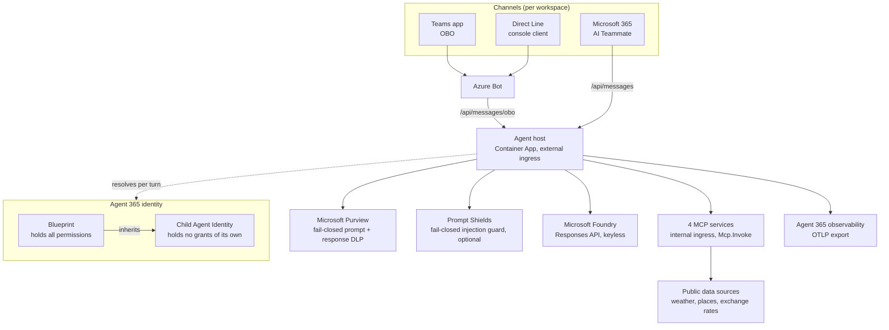
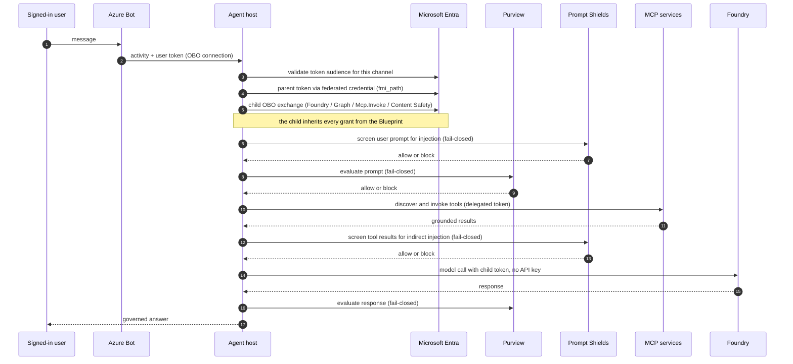
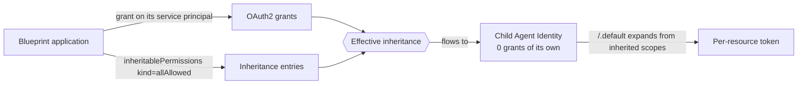

# Agent 365 custom agents

Two complete, independently deployable reference implementations of a **governed Microsoft agent**:
a travel assistant that plans real trips using live public data, under enterprise identity and data
protection.

| Workspace | Assistant | Geography | Data sources |
| --- | --- | --- | --- |
| [`japan-tourist-agent`](./japan-tourist-agent) | Japan Tourist Assistant | Japan | JMA forecasts and alerts, OpenStreetMap, Frankfurter/ECB rates |
| [`korea-tourist-agent`](./korea-tourist-agent) | Korea Tourist Assistant | South Korea | Open-Meteo, Azure Maps, Frankfurter/ECB rates |

The two are siblings, not a fork and a copy. They share one architecture and one set of guarantees,
and differ only in geography, data providers, and branding. **Read either one; pick the one whose
data providers you prefer.** Japan carries the more complete documentation and the stricter
validation suite, so it is the better starting point if you are only going to read one.

## What makes this different from a chatbot sample

Most agent samples call a model with an API key and print the answer. This one is built the way an
enterprise deployment has to be built:

- **No API keys anywhere in the inference path.** The agent authenticates to Microsoft Foundry with
  a token bound to an Agent 365 *child identity*, resolved fresh on every turn.
- **The agent acts as the signed-in user, not as itself.** Up to four separate on-behalf-of exchanges
  per turn - one for the model, one for Microsoft Graph, one for the private tool API, and one for
  Content Safety when the prompt-injection guard is enabled.
- **Data protection is fail-closed.** If Microsoft Purview cannot evaluate a prompt or response, the
  turn is rejected rather than allowed through.
- **Prompt injection is screened fail-closed too.** Azure AI Content Safety Prompt Shields checks the
  user's message *and* the text tools return, closing the indirect-injection gap that prompt/response
  DLP does not cover. Off by default; no extra Azure resource needed to turn it on.
- **Tools are real services, not functions.** Four independently deployed MCP servers behind internal
  ingress, each requiring a delegated token.
- **One backend, three channels.** A Teams app, a console client, and a Microsoft 365 AI Teammate all
  share a single deployed backend and a pinned contract.

## System architecture



## How one turn actually works

This is the part most samples skip. Every arrow is enforced, and a failure at any step fails the
turn rather than degrading it.



## The identity model, in one picture

Understanding this saves the most time. The child identity **holds no permissions of its own** - it
inherits everything from the Blueprint. A missing inheritance entry is the single most common cause
of a deployment that looks correct and fails every turn.



Both a grant **and** an inheritance entry are required. If either is missing, `/.default` expands to
an empty scope set and Entra returns `AADSTS65001`. Verify with:

```powershell
a365 query-entra inheritance   # every resource must report "Effective inheritance: OK"
```

## Prerequisites

| Requirement | Notes |
| --- | --- |
| .NET SDK | Version pinned in each workspace's `global.json`; the exact feature band is required |
| Azure subscription | Contributor on the target resource group |
| Microsoft Entra roles | Agent ID Developer to create the Blueprint; Global Administrator for tenant-wide consent |
| Agent 365 CLI | `a365`, used for Blueprint, identity, permissions, and packaging |
| Azure CLI | `az`, with the Bicep extension |
| Microsoft Foundry | An existing account with a chat-capable model deployment |
| PowerShell 7+ | The validation tools are PowerShell |

You can **read, build, and test everything offline** without an Azure subscription. Only live
deployment needs the tenant.

## Getting started

```powershell
git clone https://github.com/patrick-shim/a365-custom-agents.git
cd a365-custom-agents/japan-tourist-agent/a365-tourist-backend

./tools/Invoke-LocalCi.ps1 -Strict    # build, tests, and local health probes
./tools/Test-Repository.ps1 -Strict   # architecture and security boundary checks
```

Both should report all gates passing before you change anything. From there:

1. **Understand it** - the workspace `README.md`, then `a365-tourist-backend/README.md`.
2. **Deploy it** - `a365-tourist-backend/infra/README.md` is the deployment runbook, including the
   Entra wiring that no template can do for you.
3. **Ship a channel** - each `a365-tourist-agent-*` folder owns one channel package and contract.

## Repository layout

Both workspaces use the same shape:

```
<country>-tourist-agent/
  a365-tourist-backend/              the only deployable backend
    server/agent-host/               the agent host: identity, Purview, orchestration
    server/agent/                    agent definition and instructions
    server/mcp/                      four MCP tool services
    server/integrations/             weather, places, exchange-rate providers
    infra/                           Bicep templates and the deployment runbook
    tools/                           validation and local CI
    tests/                           unit and boundary tests
  a365-tourist-agent-obo/            Teams channel package and contract pin
  a365-tourist-agent-obo-directline/ console client for testing without Teams
  a365-tourist-agent-teammate/       Microsoft 365 AI Teammate package
```

The backend is deployed once. A frontend owns only its channel contract, package, and acceptance
evidence, and contains no backend code. The `backend-contract.lock.json` in each frontend pins the
route, audience, and identity binding it depends on, and CI fails if a frontend drifts from the
canonical contract.

Each workspace keeps its own `LICENSE`, `SECURITY.md`, `CONTRIBUTING.md`, CI workflows, and
validation suite, and neither depends on the other.

## Cost and safety notes

- The MCP services keep one replica warm each, because scale-to-zero cold starts can exceed the
  Teams channel deadline. Four warm replicas plus the host is the practical floor.
- Foundry is referenced in place and never created by these templates, so model spend is governed by
  whatever account you point at.
- All active data providers are free public APIs or Azure managed identity; no provider keys are
  required for the default configuration.
- The templates refuse to deploy outside their approved resource group. Change
  `targetResourceGroupName` deliberately, not by copying a parameter file.
- No secret is committed. Client secrets, tenant and subscription identifiers, and generated
  Agent 365 state are produced at deployment time and excluded by `.gitignore`. Both validation
  suites fail the build if a real identifier reaches a tracked file.

## License

MIT. See each workspace's `LICENSE`.