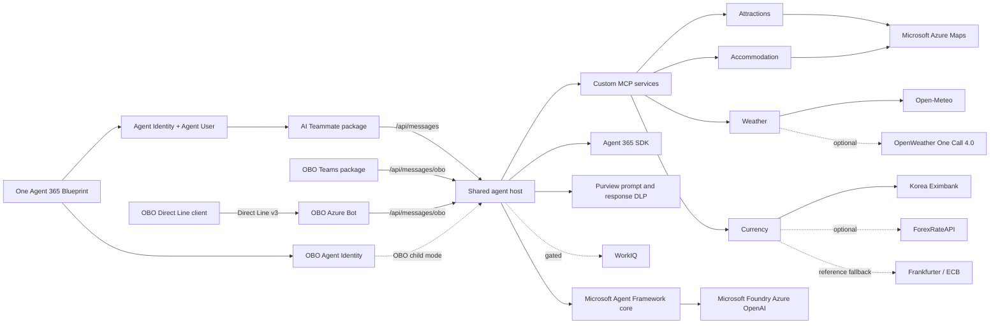

# Seoul Tourist Assistant Backend

A Microsoft-first C# shared backend for a Seoul travel assistant. Microsoft Agent Framework owns
orchestration, Agent 365 owns runtime identity and transport, Microsoft Purview protects prompt and
response content, and custom travel data is exposed through standalone MCP services. The OBO Teams,
OBO Direct Line, and AI Teammate frontend projects own their respective channel assets and
registration state.

## Architecture



The dependency direction is deliberate:

- [server/agent](server/agent) contains channel-independent instructions and agent construction.
- [server/agent-host](server/agent-host) owns transport, identity boundaries, sessions, Agent 365,
  and Purview integration.
- [server/integrations](server/integrations) encapsulates provider APIs and response mapping.
- [server/mcp](server/mcp) contains independently hostable HTTP MCP adapters.
- [contracts](contracts) contains the versioned, non-secret frontend-to-backend integration contract.
- [tools](tools) provides reusable validation for developers, automation, and coding agents.
- [tests](tests) exercises prompt safety, deterministic tools, and provider mapping without live calls.

## Current production checkpoint

The active M7 host is revision `0000028` at immutable digest
`sha256:161f9b8fa401012d5d87ccef1c215c23515709850496f585e0aca66f93b1f771`, healthy and receiving
100% of host traffic. Revision `0000027`, digest
`sha256:9dd1e4d22f824504c375cd112da36b8b25ace68aa4b8e23af12dd0de2a09004c`, is the validated rollback
boundary. The four MCP services remain healthy on revision `0000005` and their approved immutable
digests.

Revision `0000028` creates a distinct Purview-wrapped chat client for every protected turn and keeps
created clients alive only for background content-activity completion, disposing them once at host
shutdown. Isolated Direct Line acceptance proved pre-model blocks for approved synthetic credit-card,
South Korean passport, and resident-registration cases with zero model requests in the covered
interval. See [the M7 record](docs/milestones/M7-end-to-end-alignment.md) for sanitized evidence and
remaining same-revision channel gates. This checkpoint is not standing deployment authorization.

## Milestones

The source of truth is [docs/milestones/milestones.json](docs/milestones/milestones.json), with the
human protocol in [docs/milestones/README.md](docs/milestones/README.md).

- **M0, complete:** architecture, Agent Framework foundation, MCP services, the then-bundled Teams
  package, validation tools, tests, and health automation.
- **M1, complete:** governed Agent 365 onboarding and fail-closed Purview protection.
- **M2, blocked:** its historical production-governance and IRM checklist is preserved; fresh
  cross-channel and Purview alignment now belongs to M7.
- **M3, blocked:** its resilience and diagnostics backlog remains preserved.
- **M5, blocked:** its historical rollout record remains preserved; fresh deployment and live
  acceptance evidence now belongs to M7.
- **M6, complete:** non-destructive extraction of this OBO-seeded backend and its frontend contract.
- **M7, active:** 100% code, contract, infrastructure, deployment, and channel alignment with this
  backend project as the only shared runtime and deployment source.

The three channel frontends consume two protected host modes: AI Teammate uses `/api/messages`, while
OBO Teams and OBO Direct Line share `/api/messages/obo`. The two modes share one Blueprint and backend
but have separate child Agent Identities, token audiences, packages, session keys, and CLI state. M7
requires zero unexplained drift between canonical backend behavior, the deployed revision, and all
three frontend contracts while preserving those ownership and isolation boundaries.
Custom MCP arguments/results have passing DLP evidence.
WorkIQ remains disabled because Agent 365 Tooling 1.0 targets an MCP preview API incompatible with the
MCP 2.1 client.

## Microsoft Stack

- .NET 10 and C#
- Microsoft Agent Framework (`Microsoft.Agents.AI`)
- Agent 365 runtime, tooling boundary, identity context, and Microsoft OpenTelemetry
- Microsoft Foundry Azure OpenAI with `DefaultAzureCredential`
- `Microsoft.Agents.AI.Purview` prompt and response middleware
- Active providers: Azure Maps for attractions and accommodation; Open-Meteo with optional OpenWeather
  fallback; deployed currency uses Frankfurter/ECB, with Korea Eximbank and ForexRateAPI available as
  configurable higher-priority fallbacks
- KTO TourAPI Service2 adapter is compiled and tested but is not wired into the active attractions MCP
- Official Model Context Protocol C# SDK
- MSTest

## Build And Test

```powershell
dotnet build SeoulTouristAgent.slnx
dotnet test SeoulTouristAgent.slnx
./tools/Invoke-Validation.ps1
./tools/Invoke-LocalCi.ps1
./tools/tests/Invoke-ToolsSelfTest.ps1
```

The solution builds and tests without tenant or provider credentials. Live calls require the
corresponding identity, subscription, approval, or API key. See
[docs/configuration.md](docs/configuration.md) before running a live service.

For production diagnosis and safe evidence collection, see
[docs/operations/troubleshooting.md](docs/operations/troubleshooting.md).

## Validation Tools

All scripts default to offline or local read-only checks. Use `-OutputFormat Json` for automation and
agents. Online checks require explicit switches and never log in, create resources, grant consent,
change policies, run Agent 365 setup, or publish.

```powershell
./tools/Test-Prerequisites.ps1
./tools/Test-Repository.ps1
./tools/Test-Azure.ps1 -Online
./tools/Test-Purview.ps1
./tools/Invoke-Validation.ps1 -OutputFormat Json
```

See [tools/README.md](tools/README.md) for parameters, exit codes, and tenant-safe usage.

## Local Services

The checked-in non-secret model configuration targets deployment `gpt-5.6-sol` at the supplied
Microsoft Foundry Azure OpenAI endpoint. Override configuration through environment variables or
user secrets; never add a bearer token or API key to an appsettings file.

```powershell
# Authenticate with a local developer credential recognized by DefaultAzureCredential first.
dotnet run --project server/agent-host/SeoulTourist.AgentHost --launch-profile Playground
```

The host preserves `/api/health` for existing liveness probes and also exposes
`/api/health/live` and `/api/health/ready`. Readiness proves local startup and validated
configuration only; it does not call tenants, providers, Purview, or user-token flows. It reports
`Degraded` while process-local `MemoryStorage` is active; do not scale out until a durable storage
implementation is selected in a deployment milestone.

Configure each MCP independently. These placeholders are intentionally not usable credentials:

```powershell
$env:AzureMaps__ClientId = "<azure-maps-client-id-for-this-service>"
$env:OpenMeteo__BaseAddress = "https://customer-api.open-meteo.com/v1/"
$env:OpenMeteo__ApiKey = "<commercial-open-meteo-key>"
$env:OpenMeteo__RequireCommercialLicense = "true"
$env:KoreaEximbank__Enabled = "true"
$env:KoreaEximbank__AuthKey = "<korea-eximbank-key>"
$env:ForexRateApi__Enabled = "true"
$env:ForexRateApi__ApiKey = "<optional-forexrateapi-key>"
$env:Frankfurter__Enabled = "true"
$env:Frankfurter__BaseAddress = "https://api.frankfurter.dev/v1/"

dotnet run --project server/mcp/attractions/SeoulTourist.Mcp.Attractions --launch-profile http
dotnet run --project server/mcp/weather/SeoulTourist.Mcp.Weather --launch-profile http
dotnet run --project server/mcp/accommodation/SeoulTourist.Mcp.Accommodation --launch-profile http
dotnet run --project server/mcp/currency/SeoulTourist.Mcp.Currency --launch-profile http
```

The local endpoints are listed in [.vscode/mcp.json](.vscode/mcp.json). Currency retains the
deterministic caller-supplied-rate tool and also provides attributed live/reference-rate tools.

## Agent 365 And Purview

Agent 365 generated configuration, `ToolingManifest.json`, and published packages containing real
IDs are owned by the frontend projects. They must never be fabricated, hand-edited, copied into
this backend, or read by backend CI. The route, audience, health, and MCP boundaries for the two
protected host modes consumed by all three frontends are defined in
[contracts/frontend-backend-contract.json](contracts/frontend-backend-contract.json).

Purview must protect textual ingress and egress before content reaches the model or channel, fail
closed when policy evaluation fails, and keep sensitive telemetry disabled. Agent Framework Purview
middleware does not automatically cover system instructions, MCP/WorkIQ tool arguments and results,
binary content, logs, or telemetry. Custom MCP arguments and results therefore use a separate
fail-closed Purview guard. WorkIQ remains disabled until Microsoft publishes Agent 365 Tooling
compatible with MCP 2.1 and its generated tools pass the same guard.

Each protected turn receives a fresh Purview wrapper so protection-scope and ETag state is never
shared across requests. The host registry retains created wrappers long enough for background audit
work and disposes them once during application shutdown; callers must not cache or dispose a wrapper
per turn.

## Docker

The root [Dockerfile](Dockerfile) publishes the shared Agent 365 host as a multi-stage .NET 10 image, runs
as the built-in non-root user, and listens on port `8080`.

```powershell
docker build --tag seoul-tourist-agent:local .
docker build --file Dockerfile.mcp --target attractions --tag seoul-tourist-attractions:local .
docker build --file Dockerfile.mcp --target weather --tag seoul-tourist-weather:local .
docker build --file Dockerfile.mcp --target accommodation --tag seoul-tourist-accommodation:local .
docker build --file Dockerfile.mcp --target currency --tag seoul-tourist-currency:local .
docker run --rm --publish 8080:8080 `
  --env ASPNETCORE_ENVIRONMENT=Development `
  seoul-tourist-agent:local
Invoke-RestMethod http://localhost:8080/api/health
```

For Azure, keep `ASPNETCORE_ENVIRONMENT=Production` and token validation enabled. The host UAMI owns
ACR pull and Blueprint federation only; the effective child runtime identities receive the minimum
Foundry model data-plane role. Supply Purview and identity values through protected deployment
configuration as described in [docs/configuration.md](docs/configuration.md). The image contains no
credential material.
Only this host image needs rebuilding for a two-route host change. The four independently hosted MCP
images can remain deployed unless their own code or shared authorization contract changes.

## Frontend Contract

The OBO Teams, OBO Direct Line, and AI Teammate frontend projects each pin the non-secret contract
version and own their channel validation or package registration. Backend deployment receives Blueprint
and child identity values only through protected configuration, never from frontend source or generated
state.
