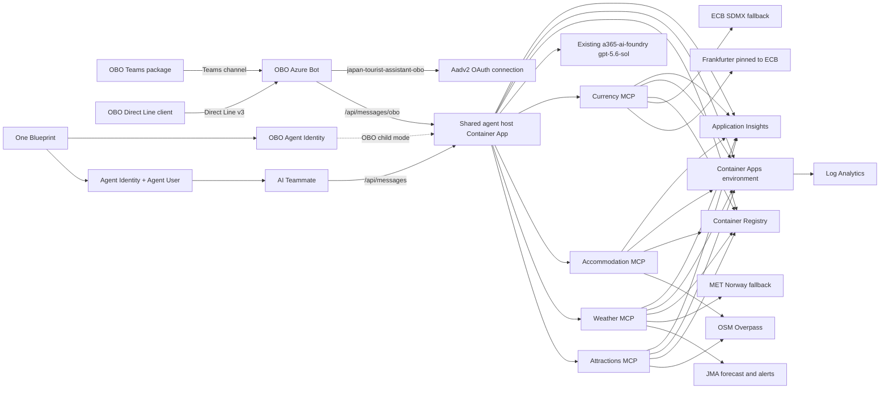

# Japan Tourist Assistant backend infrastructure

This directory is the only backend deployment source. It contains two resource-group-scoped
deployment paths:

- `main.bicep` creates the Japan Tourist Assistant backend resources and the protected MCP resource API.
- `live-backend-container-apps-update.bicep` updates or rolls back the five existing Container Apps
  without touching shared infrastructure.

> M8 is active. **Read the whole runbook before running any of it.** These commands create and
> modify real Azure and Microsoft Entra objects. Steps 1-6 of the dry-run sequence are read-only;
> everything after that mutates your tenant. Always run the structured what-if and confirm the
> rollback boundary first.

## Deployment boundary

| Boundary | Value |
| --- | --- |
| Target resource group | existing `rg-a365-custom-agents` (never created by these templates) |
| Template scope | `resourceGroup` in both entry templates |
| Foundry account | existing `a365-ai-foundry` in `rg-ai-foundry`, referenced only |
| Foundry project | existing `default` |
| Model deployment | existing `gpt-5.6-sol`, a Responses API deployment |
| Host model access | Foundry **project** endpoint plus `/openai/v1`, deployment name, and implicit Responses API versioning |
| Subscription | supplied by the CLI context, never committed to a template |

Two independent controls keep the deployment inside one resource group:

1. `targetScope = 'resourceGroup'`. ARM cannot create a resource group from a resource-group
   deployment, so no parameter or edit can make these templates provision one.
2. A deployment-time guard. `targetResourceGroupName` is an allowed-value parameter, and every tagged
   resource depends on `approvedDeploymentScopes[toLower(resourceGroup().name)]`. A deployment aimed
   at any other group fails ARM validation with an error that names the approved group, before a
   single resource is evaluated.

`./tools/Test-Deployment.ps1` asserts all of this offline, plus Japan Tourist Assistant naming, the absence of
retired Seoul deployment names, and compiled-template parity.

## Architecture



Only `ca-agent-japanexpert` has external ingress. The four MCP apps use internal ingress and validate
the shared delegated `Mcp.Invoke` scope. Agent identity is never the host UAMI: `a365` owns the
Blueprint, BlueprintPrincipal, and each Agent Identity/Agentic User. Every active MCP data source is
a credential-free public HTTPS API, so no workload holds a data-plane role or reads a secret.

## Deterministic names

Every name is a parameter whose default derives from `resourceBaseName` (`japanexpert`, lowercase
alphanumeric). Supply a different value once to move an entire environment; supply individual name
parameters to target pre-existing resources during an update or rollback.

| Parameter | Default | Azure limit |
| --- | --- | --- |
| `logAnalyticsWorkspaceName` | `log-japanexpert` | 63 |
| `applicationInsightsName` | `appi-japanexpert` | 255 |
| `containerRegistryName` | `crjapanexpert` | 50, alphanumeric, globally unique |
| `containerAppEnvironmentName` | `cae-japanexpert` | 60 |
| `hostIdentityName` | `id-agent-japanexpert` | 128 |
| `attractionsIdentityName` | `id-attract-japanexpert` | 128 |
| `weatherIdentityName` | `id-weather-japanexpert` | 128 |
| `accommodationIdentityName` | `id-stay-japanexpert` | 128 |
| `currencyIdentityName` | `id-fx-japanexpert` | 128 |
| `hostAppName` | `ca-agent-japanexpert` | 32 |
| `attractionsAppName` | `ca-attract-japanexpert` | 32 |
| `weatherAppName` | `ca-weather-japanexpert` | 32 |
| `accommodationAppName` | `ca-stay-japanexpert` | 32 |
| `currencyAppName` | `ca-fx-japanexpert` | 32 |
| `mcpApiApplicationName` | `api-japanexpert` | 120 |
| `azureBotName` | `bot-japanexpert` | 64, globally unique bot handle |

The Azure Bot is phase-gated by `deployAzureBot` (default `false`) and its Direct Line site name
defaults to `japan-expert-directline`.

Image repositories derive from `imageRepositoryPrefix` (`japan-expert`): `japan-expert-agent`,
`japan-expert-attractions`, `japan-expert-weather`, `japan-expert-accommodation`, and
`japan-expert-currency`.

`main.parameters.json` pins the non-secret values only. Tenant, principal, Blueprint, child-identity,
channel-application, and image-digest values are always command parameters, never committed.

`containerRegistrySkuName` defaults to `Basic`. M8 uses one region, public registry access with
managed-identity pulls, and no private endpoints, geo-replication, or dedicated data endpoints, so
Premium features are not required. Changing the tier is a reviewed cost and capacity decision.

### Committed identifier policy

Source may commit fixed non-secret names: the target resource group `rg-a365-custom-agents`, the
existing Foundry account `a365-ai-foundry`, its `default` project, its endpoint, and the
`gpt-5.6-sol` model deployment. Source must never commit the subscription GUID, tenant or directory
ID, an owner user principal name, any principal or object ID, or a full ARM resource ID. Those stay
command parameters or `<placeholder>` values, and the runbook below constructs any resource ID from
them at run time. `./tools/Test-Repository.ps1` fails the build if one is committed.

`location` defaults to `resourceGroup().location` in the template and is pinned to `koreacentral` in
the parameter file, because the existing `rg-a365-custom-agents` group and the existing
`a365-ai-foundry` account both live in Korea Central and every model call is a host-to-Foundry call.
Overriding `location` to a Japan region is supported and is an approver decision; if you take it,
re-run the quota and availability checks for that region and accept the cross-region model latency.

## Provider settings

No active workload reads a secret, so M8 creates no Key Vault, no Key Vault RBAC, and no secret-seeding
parameters, and the `key-vault.bicep` module was deleted rather than kept as optional plumbing. The
initial Japan deployment creates only resources current source requires. Every active data
source is credential-free: OpenStreetMap Overpass for places, the Japan
Meteorological Agency for forecasts and alerts with MET Norway as a labelled current-conditions
fallback, and Frankfurter pinned to ECB with direct ECB SDMX as the fallback. The Korea-specific KTO,
Eximbank, Open-Meteo, OpenWeather, and ForexRateAPI plumbing and the Azure Maps account, its
identities' data-plane role, and its `AzureMaps__ClientId` setting were removed because no source
path consumes them.

`./tools/Test-Deployment.ps1` keeps this honest from both directions. It reads the server tree for a
secret client and fails if infrastructure declares a Key Vault while no source reads one, or if source
reads one while infrastructure declares none. It also fails on any module file that no entry template
references. A future secret-backed provider therefore relaxes the rule automatically once its client
lands, but still needs a separately reviewed milestone and infrastructure design.

MCP data-source configuration is non-secret deployment configuration. Both templates carry identical
defaults, so an update or rollback never silently re-points a data source. Section and property names
mirror the MCP service options classes.

All four MCP apps default to one replica. Their response caches are in-process and their upstream
sources are public services, so implicit scale-out would multiply external calls and weaken cache
effectiveness. Scale changes require a shared-cache/single-flight review.

| Parameter | Default | Deployed setting |
| --- | --- | --- |
| `mcpUserAgent` | `JapanExpertMcp/1.0 (+https://github.com/patrick-shim/rg-a365-custom-agents)` | `Overpass__UserAgent`, `MetNorway__UserAgent` |
| `overpassEndpoint` | `https://overpass-api.de/api/interpreter` | `Overpass__Endpoint` |
| `jmaForecastEnabled` | `true` | `Jma__ForecastEnabled` |
| `jmaForecastBaseAddress` | `https://www.jma.go.jp/bosai/forecast/data/forecast/` | `Jma__ForecastBaseAddress` |
| `jmaAlertFeedAddress` | `https://www.data.jma.go.jp/developer/xml/feed/extra.xml` | `Jma__AlertFeedAddress` |
| `metNorwayEnabled` | `true` | `MetNorway__Enabled` |
| `metNorwayBaseAddress` | `https://api.met.no/weatherapi/locationforecast/2.0/` | `MetNorway__BaseAddress` |
| `frankfurterEnabled` | `true` | `Frankfurter__Enabled` |
| `frankfurterBaseAddress` | `https://api.frankfurter.dev/v2/` | `Frankfurter__BaseAddress` |
| `frankfurterProviders` | `ECB` | `Frankfurter__Providers` |
| `ecbSdmxEnabled` | `true` | `EcbSdmx__Enabled` |
| `ecbSdmxBaseAddress` | `https://data-api.ecb.europa.eu/service/data/EXR/` | `EcbSdmx__BaseAddress` |
| `placeSearchCacheTtlSeconds` | `86400` | `Cache__TtlSeconds` (attractions, accommodation) |
| `weatherForecastCacheTtlSeconds` | `1800` | `Cache__ForecastTtlSeconds` |
| `weatherAlertCacheTtlSeconds` | `60` | `Cache__AlertTtlSeconds` |
| `weatherCurrentCacheTtlSeconds` | `600` | `Cache__CurrentTtlSeconds` |
| `exchangeRateCacheTtlSeconds` | `21600` | `Cache__TtlSeconds` (currency) |

Cache lifetimes are deployment parameters because they are call-rate and freshness policy against
public community endpoints, not just tuning: the long place-search lifetime keeps Overpass from being
called once per turn, and the 60-second alert lifetime keeps a newly issued JMA warning from being
withheld. Cache size budgets stay on the service defaults.

`MetNorway__CoordinateDecimals` is pinned to `4` because the MET Norway terms cap outgoing coordinate
precision. Timeouts, response-byte caps, fetch multipliers, alert keywords, cache size limits, and
lookback windows stay on the service defaults so the deployed container spec carries only
operator-relevant configuration.

The Overpass and MET Norway `User-Agent` must name the product and carry a public contact reference.
The committed default uses a public project URL; it must never carry a mailbox, user principal name,
or any other tenant-bound identifier. Operators may override `mcpUserAgent` at deployment time.

Moving to a self-hosted or contracted Overpass instance, a mirrored JMA endpoint, or a different
Frankfurter host is a parameter change, not a code or template change:

```powershell
--parameters overpassEndpoint='https://<your-overpass-host>/api/interpreter' `
  mcpUserAgent='<Product>/<version> (+https://<your-project-url>)'
```

`./tools/Test-Deployment.ps1` reads each MCP service's own `appsettings.json` to learn which
configuration sections it binds, then asserts that both templates configure exactly those sections
over HTTPS with a commit-safe User-Agent and no retired provider setting.

## Mutation boundary

Inside the template boundary, and therefore covered by ARM validation, what-if, and rollback:

- All Azure resources listed above, in `rg-a365-custom-agents` only.
- ACR `AcrPull` for the five workload identities. No workload holds any other data-plane role,
  because every active MCP data source is a credential-free public API.
- The `api-japanexpert` Entra application and service principal exposing delegated `Mcp.Invoke`.
  These are tenant directory objects, not resource-group resources; review them explicitly.
- The Azure Bot, Direct Line v3 and Teams channels, and `japan-tourist-assistant-obo` Aadv2 connection, when
  `deployAzureBot` is true.

### Azure Bot and Direct Line

The Agent 365 CLI does not create Azure Bot resources, so the bot and its channels belong to this
template and land in `rg-a365-custom-agents` like every other resource. The bot is bound to the
protected OBO route and to the OBO channel application:

| Parameter | Default | Purpose |
| --- | --- | --- |
| `deployAzureBot` | `false` | Phase gate. Turn on only when the OBO channel application exists. |
| `azureBotName` | `bot-japanexpert` | Bot resource name and globally unique handle. |
| `azureBotDisplayName` | `Japan Tourist Assistant` | Name shown to channel users. |
| `azureBotSkuName` | `F0` | Azure Bot SKU. |
| `deployDirectLineChannel` | `true` | Direct Line channel for the OBO Direct Line console client. |
| `deployTeamsChannel` | `true` | Microsoft Teams channel for the OBO Teams package. |
| `deployOboOAuthConnection` | `true` | Aadv2 Bot Token Service connection shared by both OBO clients. |
| `directLineSiteName` | `japan-expert-directline` | Direct Line v3 site. |
| `directLineTrustedOrigins` | `[]` | Empty by design; see enhanced authentication below. |
| `oboOAuthConnectionName` | `japan-tourist-assistant-obo` | Name shared with the host's `obo-user` handler. |
| `oboChannelAppClientSecret` | secure, empty | Phase-two channel-app credential written to Bot Token Service; never committed or output. |
| `oboOAuthScope` | empty | Fresh Blueprint delegated ingress scope requested by Aadv2. |

One bot serves both OBO clients. The Teams channel carries the OBO Teams package and the Direct Line
channel carries the OBO Direct Line client; both reach the same `/api/messages/obo` route on the same
host revision, which is what same-revision cross-channel acceptance requires.

**Direct Line protocol.** The site sets `isV3Enabled: true` and `isV1Enabled: false`. The OBO client
is a .NET console application on Direct Line v3, so v1 stays off to remove an unused legacy surface.

**Enhanced authentication.** `isSecureSiteEnabled` is bound to `!empty(directLineTrustedOrigins)`, and
the list is empty by default, so enhanced authentication stays off. Trusted origins are a browser
concept: they restrict which web origins may exchange a Direct Line secret for a token. The OBO Direct
Line client is a console application with no web origin, so there would be nothing valid to list.
Supply origins, and enhanced authentication turns on automatically, only if a browser-hosted client is
added.

`oboChannelAppId` becomes the bot's `msaAppId`, `tenantId` becomes its `msaAppTenantId`, and
`msaAppType` is `SingleTenant`. The messaging endpoint is computed inside the deployment as
`https://<host FQDN>/api/messages/obo`, so no manual endpoint value is supplied and the bot can never
be pointed at the AI Teammate route by mistake. The bot never appears in the existing-app update
wrapper, so a host or MCP image update cannot modify it.

**Sequencing.** The host FQDN is known inside the deployment, so it is not a blocker. The OBO channel
application ID is not available until that application is registered, so the bot is a second pass:

1. Phase 1: deploy with `deployAzureBot=false`. This creates the host, the MCP services, and the host
   managed identity, and outputs `oboMessagingEndpoint`.
2. Complete the approved Agent 365 workflow, read back the new Blueprint's delegated ingress scope,
   and register the separate single-tenant OBO channel application with permission to that scope.
3. Phase 2: redeploy the same template with `deployAzureBot=true`, `oboChannelAppId=<app-id>`, and
   `oboChannelAppClientSecret` plus `oboOAuthScope` supplied through a protected parameter source
   outside the repository. What-if for this pass must show one bot, two channels, and one OAuth
   connection create, with no unrelated change.

Deploying with `deployAzureBot=true` while a channel, the OAuth connection, the OBO channel
application ID or secret, or the Blueprint scope is absent fails ARM validation rather than creating
a partial channel topology.

**Direct Line secret.** A Direct Line site key is a channel secret. It is never read, output, or
logged by these templates, and `./tools/Test-Deployment.ps1` fails if a template adds a
`listChannelWithKeys` call or a secret-shaped output. Retrieve it only after deployment, through the
approved channel workflow, and store it in the operator's own secret store:

```powershell
# Approved post-deployment retrieval. Do not echo, log, commit, or paste the result.
az bot directline show `
  --name '<azure-bot-name>' --resource-group $resourceGroup --with-secrets true `
  --query "properties.properties.sites[?siteName=='japan-expert-directline'].key | [0]" `
  --output tsv
```

**OAuth secret.** The official
[`Microsoft.BotService/botServices/connections@2022-09-15`](https://learn.microsoft.com/azure/templates/microsoft.botservice/2022-09-15/botservices/connections)
contract marks `clientSecret` as sensitive and directs callers to use a secure parameter. Both the
entry template and Bot module use `@secure()`. The value is omitted from `main.parameters.json`,
never appears in source or an output, and is supplied only for the separately reviewed Bot phase
through a protected parameter source outside the repository. The five-app update wrapper cannot
reapply or modify it because that wrapper contains no Bot resource.

**Rollback.** Delete the OAuth connection and both channels first, then the bot, using their captured
M8 names. The OBO channel application is not created here and is rolled back by whoever registered it.

### OBO channel identity and the `japan-tourist-assistant-obo` OAuth connection

Four distinct objects carry the OBO path. Collapsing any two of them is a security change, not a
simplification:

| Object | Purpose | Owner |
| --- | --- | --- |
| OBO channel application | Azure Bot `msaAppId`, inbound activity audience, Teams manifest bot ID, outbound Bot Connector credential | operator or frontend, registered outside this template |
| Japan Tourist Assistant Blueprint | parent identity that exposes the delegated ingress scope | Agent 365 CLI |
| OBO child Agent Identity | performs the child-bound token exchange | Agent 365 CLI |
| `japan-tourist-assistant-obo` OAuth connection | Bot Token Service sign-in that returns the exchangeable user assertion | backend Bot phase |

Evidence from Agent 365 CLI `1.1.214`:

- The CLI PATCHes the Blueprint with an identifier URI and the delegated scope
  **`access_agent_as_user`** ("Access agent on behalf of user" / "Allow the agent to act on behalf of
  the signed-in user"). Its failure message is explicit: if that PATCH does not complete, *"the
  blueprint is incomplete and OBO token exchange will fail"*. The ingress scope is therefore
  CLI-owned; do not create or edit it here.
- The CLI does not create the Azure Bot, its channels, or its OAuth connection in the Blueprint path.
  Those resources therefore remain backend infrastructure rather than generated Agent 365 state.

**Credential shape.** The outbound Bot Connector path is already secretless: the host uses
`Connections__OboChannelConnection` with `AuthType=FederatedCredentials`, `ClientId=<channel app>` and
`FederatedClientId=<host UAMI client ID>`. The Bot Token Service OAuth connection is different: the
service performs the sign-in itself, so its `Aadv2` setting stores a client secret. The official
schema confirms it - `ConnectionSettingProperties.clientSecret` is typed as a secure value by Bicep's
own linter - and there is no federated or managed-identity variant in `2022-09-15`.

**Supported connection shape.** The official Teams SSO workflow uses an `Aadv2` Bot connection backed
by the Bot's channel application, with `tenantId` and
`tokenExchangeUrl=api://botid-<channel-app-id>`. M8 follows that shape without collapsing identities:
the connection client is the separate OBO channel application, while the configured OBO child remains
the downstream token-exchange identity. The connection scope is not guessed or hard-coded; it is the
delegated ingress scope read back from the newly registered Japan Tourist Assistant Blueprint after the Agent 365
workflow. The channel application must have delegated permission to that scope before the Bot phase.

The OAuth connection is created only in the phase-gated Bot module. Its client secret crosses both
Bicep boundaries as a secure parameter, is never committed or output, and is not present in the
Container App update wrapper. `./tools/Test-Deployment.ps1` fails if Direct Line v1 is enabled, the
Teams or Aadv2 connection is absent, OAuth inputs are not fail-closed, either secret parameter loses
`@secure()`, a literal secret appears, or any secret-shaped output/key-listing call is added.

Outside the template boundary, and therefore each a separate approved step:

- Foundry data-plane RBAC for the Agent 365 child identities. The Foundry account lives in
  `rg-ai-foundry`, so granting it from this template would break the single-resource-group boundary.
  Each effective child runtime identity gets `Cognitive Services User` at the Foundry account scope;
  the host UAMI never does.
- Agent 365 Blueprint, child identities, endpoints, permissions, packages, and installations, which
  belong to the owning frontend projects.
- The Blueprint federated identity credential that binds the host managed identity. It is added
  through Microsoft Graph after Agent 365 setup as a separately approved tenant mutation; see step 11.
- Image builds and pushes.

### Agent 365 identity handoff

The host user-assigned managed identity is created by this template. The Blueprint, its child
identities, its permissions, and its registration are created by the Agent 365 CLI. Binding the two is
one reviewed Microsoft Graph step. That split is enforced offline by `./tools/Test-Deployment.ps1`.

The ordering is fixed: deploy the backend first, then run Agent 365 setup, then bind. The deployment
publishes the value the bind step needs:

```powershell
az deployment group show `
  --resource-group $resourceGroup --name '<deployment-name>' `
  --query properties.outputs.hostManagedIdentityPrincipalId.value --output tsv
```

Agent 365 CLI `1.1.214` has no option to accept that principal ID during a config-free
`a365 setup all --agent-name` run, so a clean setup creates the Blueprint **without** the host
credential and the host cannot acquire Blueprint tokens until it is added. The documented production
path is to add the credential through Microsoft Graph after setup. See step 11 of the runbook. Do not
put it in Bicep and do not edit generated CLI configuration.

## Dry-run runbook

Run every step from `a365-tourist-backend`. Replace `<...>` placeholders with values from your own
protected sources; never commit them. Steps 1-6 are read-only. Step 7 onward requires separate
explicit approval.

### 1. Confirm context and pin the target

```powershell
$subscriptionId = '<subscription-id>'
$resourceGroup  = 'rg-a365-custom-agents'
$foundryGroup   = 'rg-ai-foundry'

az account show --subscription $subscriptionId --output json
az group show --name $resourceGroup --subscription $subscriptionId --output json
az resource list --resource-group $resourceGroup --subscription $subscriptionId --output table
```

Reject the plan if the resource group does not already exist. These templates never create one.

### 2. Confirm the existing Foundry target

```powershell
az cognitiveservices account show --name a365-ai-foundry --resource-group $foundryGroup --output json
az cognitiveservices account deployment show `
  --name a365-ai-foundry --resource-group $foundryGroup --deployment-name gpt-5.6-sol --output json
```

Expected control-plane endpoint `https://a365-ai-foundry.cognitiveservices.azure.com/` and
OpenAI-compatible inference endpoint `https://a365-ai-foundry.services.ai.azure.com`. Do not
recreate, move, or change the account, the `default` project, or the model deployment.

`gpt-5.6-sol` (version `2026-07-09`) is a Responses API deployment served from the **account-level**
OpenAI-compatible surface. The project-scoped `/api/projects/<name>` form does not publish
`/openai/v1` on this account and returns HTTP 404/403, so the host is configured with the account
endpoint and the deployment name only:

| Host setting | Source |
| --- | --- |
| `AgentHost__FoundryProjectEndpoint` | derived as `https://<foundryAccountName>.services.ai.azure.com`, overridable with `foundryProjectEndpoint`; the host appends `/openai/v1` |
| `AgentHost__FoundryModelDeployment` | `foundryModelDeploymentName`, default `gpt-5.6-sol` |
| `AgentApplication__UserAuthorization__Handlers__agentic-foundry__Settings__Scopes__0` | `foundryTokenScope`, default `https://ai.azure.com/.default` |

Keyless inference uses the child identity's token for the `https://ai.azure.com/.default` resource.
Microsoft's keyless-authentication guidance specifies the built-in `Cognitive Services User` role at
the Foundry resource scope. That grant is an approved step outside this template; see the runbook.

The host builds the OpenAI-compatible base as `<foundry-account-endpoint>/openai/v1`; the OpenAI
Responses client appends the `/responses` operation and the v1 API uses implicit versioning. The
template therefore injects neither a raw `/openai/responses` path nor an `api-version`. The
project-scoped `/api/projects/<name>` form does not publish `/openai/v1` on this account and returns
HTTP 404 or 403, so it must never be configured. Because the endpoint is derived from the pinned
account name rather than read from the account resource, deployment needs no data-plane read on the
cross-group Foundry account. `./tools/Test-Deployment.ps1` reads the required settings from the host
options contract, so a host configuration rename fails validation with the exact missing key.

### 3. Offline validation

```powershell
./tools/Test-Deployment.ps1 -OutputFormat Json
./tools/Invoke-Validation.ps1 -OutputFormat Json

az bicep build --file infra/main.bicep --outfile '<temporary-output-path>'
az bicep build --file infra/live-backend-container-apps-update.bicep `
  --outfile infra/live-backend-container-apps-update.json
```

`live-backend-container-apps-update.json` is the checked-in compiled form of the update wrapper and
must stay synchronized with its Bicep source.

### 4. Confirm globally unique names and provider registration

```powershell
az acr check-name --name crjapanexpert --output json
az provider show --namespace Microsoft.App --query registrationState --output tsv
az provider show --namespace Microsoft.ContainerRegistry --query registrationState --output tsv
az provider show --namespace Microsoft.BotService --query registrationState --output tsv
```

If a name is unavailable, override that single name parameter instead of editing the template.
Registering a resource provider is a subscription mutation and needs its own approval.
`Microsoft.BotService` was `NotRegistered` at the 2026-08-30 baseline. The 2026-08-31 read-only
recheck found it `Registered`, so the current Bot phase requires no provider-registration mutation.

### 5. ARM validation

```powershell
$tenantId = '<entra-tenant-id>'

az deployment group validate `
  --resource-group $resourceGroup `
  --subscription $subscriptionId `
  --template-file infra/main.bicep `
  --parameters '@infra/main.parameters.json' `
  --parameters tenantId=$tenantId `
  --parameters deployedBy='<operator-or-automation-id>' `
  --parameters sessionId='<deployment-session-id>' `
  --parameters createdAt='<ISO-8601-timestamp>' `
  --output json
```

A validation error that names `rg-a365-custom-agents` means the command targeted the wrong group.
Fix the command, never the guard.

### 6. Structured what-if

```powershell
az deployment group what-if `
  --resource-group $resourceGroup `
  --subscription $subscriptionId `
  --template-file infra/main.bicep `
  --parameters '@infra/main.parameters.json' `
  --parameters tenantId=$tenantId `
  --result-format FullResourcePayloads `
  --no-pretty-print
```

Review before approval: every change is a create in `rg-a365-custom-agents`, there is no resource
group create, no resource lands in `rg-ai-foundry`, no Foundry resource is modified, and every Entra
object is expected. Reject unreviewed identity, RBAC, SKU, region, scale, ingress, route, audience,
Blueprint, child-ID, or secret drift.

### 7. Immutable images (separately approved)

```powershell
$tag = '<immutable-tag>'
az acr build --registry crjapanexpert --image "japan-expert-agent:$tag" --file Dockerfile .
az acr build --registry crjapanexpert --image "japan-expert-attractions:$tag" --file Dockerfile.mcp --target attractions .
az acr build --registry crjapanexpert --image "japan-expert-weather:$tag" --file Dockerfile.mcp --target weather .
az acr build --registry crjapanexpert --image "japan-expert-accommodation:$tag" --file Dockerfile.mcp --target accommodation .
az acr build --registry crjapanexpert --image "japan-expert-currency:$tag" --file Dockerfile.mcp --target currency .

az acr repository show-manifests --name crjapanexpert --repository japan-expert-agent `
  --detail --query "[?tags[?@=='$tag']].digest" --output tsv
```

Record the five digests. Application deployments always reference `repository@sha256:<digest>`, never
a tag.

### 8. Application deployment and updates

The first application rollout reuses `main.bicep` with real images and the Agent 365 identifiers from
the frontend CLI workflows:

```powershell
$acr = 'crjapanexpert.azurecr.io'
$agent365AgentIds = @{ agenticUser = ''; onBehalfOf = '<obo-child-id>' } | ConvertTo-Json -Compress

az deployment group create `
  --resource-group $resourceGroup `
  --subscription $subscriptionId `
  --name japanexpert-app-'<change-id>' `
  --template-file infra/main.bicep `
  --parameters '@infra/main.parameters.json' `
  --parameters tenantId=$tenantId `
  --parameters containerImage="$acr/japan-expert-agent@sha256:<host-digest>" `
  --parameters attractionsImage="$acr/japan-expert-attractions@sha256:<attractions-digest>" `
  --parameters weatherImage="$acr/japan-expert-weather@sha256:<weather-digest>" `
  --parameters accommodationImage="$acr/japan-expert-accommodation@sha256:<accommodation-digest>" `
  --parameters currencyImage="$acr/japan-expert-currency@sha256:<currency-digest>" `
  --parameters agent365BlueprintId='<blueprint-id>' `
  --parameters agent365AgentIds="$agent365AgentIds" `
  --parameters oboChannelAppId='<obo-azure-bot-app-id>'
```

That rollout keeps the default `deployAzureBot=false`. For the separately approved Bot phase, create
a transient ARM parameter file in a protected location outside the repository containing only
`deployAzureBot=true`, `oboChannelAppId`, `oboChannelAppClientSecret`, and `oboOAuthScope`. Never print,
commit, or pass the secret as a literal command argument. Run `az deployment group validate` and
`az deployment group what-if` with that file plus `@infra/main.parameters.json`; approve only the
expected bot, Direct Line channel, Teams channel, and OAuth connection creates with no other delta.
Then run `az deployment group create` with those exact reviewed inputs and remove the transient secret
material through the operator's approved secret-handling process.

Later host or MCP changes use the update wrapper, which touches only the five existing Container
Apps. Copy `live-backend-container-apps-update.parameters.sample.json` to a candidate file **outside
this directory** - the git-ignored `.azure/` tree or a path outside the repository - and fill in the
digests and identifiers there. A filled candidate carries tenant and principal values and must never
be committed:

```powershell
az deployment group validate `
  --resource-group $resourceGroup `
  --template-file infra/live-backend-container-apps-update.bicep `
  --parameters '@<candidate-parameters.json>'

az deployment group what-if `
  --resource-group $resourceGroup `
  --template-file infra/live-backend-container-apps-update.bicep `
  --parameters '@<candidate-parameters.json>' `
  --result-format FullResourcePayloads `
  --no-pretty-print
```

Expect exactly five existing Container App modifications, no creates, no deletes, and an explanation
for every property delta.

### 9. Rollback boundary

Record the rollback target *before* mutating anything.

```powershell
az containerapp revision list --name ca-agent-japanexpert --resource-group $resourceGroup `
  --query "[].{revision:name, active:properties.active, image:properties.template.containers[0].image}" `
  --output table
```

- Application rollback: build a second parameter file with the previously deployed digests, validate
  and what-if it through the same commands, then deploy it. A revision-level rollback is
  `az containerapp ingress traffic set` back to the recorded healthy revision.
- Infrastructure rollback for a first deployment: delete only the resources this deployment created
  in `rg-a365-custom-agents`. Never delete the resource group, anything in `rg-ai-foundry`, or the
  historical Seoul production boundary.
- Directory rollback: delete only the `api-japanexpert` application and service principal created by
  this deployment.

### 10. Foundry runtime access (separate approval, outside the template)

`gpt-5.6-sol` is reached keylessly through the Foundry project Responses endpoint, which is guarded
by the `https://ai.azure.com/.default` resource. Grant each **effective child runtime identity** the
Microsoft-documented built-in inference role, `Cognitive Services User`, at the existing Foundry **account**
scope. Do not grant it to the host user-assigned managed identity: the host UAMI is bootstrap and
registry-pull identity only, and every inference token is child-bound. Do not add it to these
templates; the account lives in another resource group.

```powershell
az role assignment create `
  --assignee-object-id '<child-principal-id>' --assignee-principal-type ServicePrincipal `
  --role 'Cognitive Services User' `
  --scope "/subscriptions/$subscriptionId/resourceGroups/$foundryGroup/providers/Microsoft.CognitiveServices/accounts/a365-ai-foundry"
```

Repeat for both child identities, then read back with
`az role assignment list --assignee '<child-principal-id>' --scope '<same-scope>'` and confirm exactly
one assignment per child at account scope and none for the host UAMI. Rollback is
`az role assignment delete` with the same assignee, role, and scope.

The built-in role includes broader Cognitive Services actions, including account key retrieval, even
though this host never requests or uses keys. A custom role containing only the documented inference
data actions is preferable after it is proven against this exact Responses deployment; record that
live evidence in the milestone before replacing the supported built-in role. `Cognitive Services
OpenAI User` is deliberately not used because it governs the account-root Azure OpenAI surface rather
than the project Responses endpoint this host calls.

### 11. Blueprint federated identity credential (separate approval, outside the template)

The Agent 365 CLI creates the Blueprint without a credential for an externally deployed host managed
identity. The documented production path is to add it through Microsoft Graph after setup. This never
edits generated CLI state, never enters Bicep, and leaves the CLI owning the Blueprint, its
permissions, and its registration.

Run it only after the Blueprint exists, the host managed identity exists, and the change is approved.

```powershell
$hostPrincipalId = az deployment group show `
  --resource-group $resourceGroup --name '<deployment-name>' `
  --query properties.outputs.hostManagedIdentityPrincipalId.value --output tsv

$credential = @{
  name      = '<m8-credential-name>'
  issuer    = "https://login.microsoftonline.com/$tenantId/v2.0"
  subject   = $hostPrincipalId
  audiences = @('api://AzureADTokenExchange')
} | ConvertTo-Json -Compress

az rest --method POST `
  --uri 'https://graph.microsoft.com/v1.0/applications/<blueprint-application-object-id>/federatedIdentityCredentials' `
  --headers 'Content-Type=application/json' `
  --body $credential
```

Graph addresses the application by object ID on that path; the `appId` alternate key is available if
only the application ID is at hand.

Read back and confirm exactly one M8 credential with the expected issuer tenant, the subject equal to
the deployment output above, and the `api://AzureADTokenExchange` audience. Record the returned
credential `id` in the change record.

```powershell
az rest --method GET `
  --uri 'https://graph.microsoft.com/v1.0/applications/<blueprint-application-object-id>/federatedIdentityCredentials' `
  --query "value[].{id:id, name:name, issuer:issuer, subject:subject, audiences:audiences}"
```

Rollback deletes that one credential and nothing else:

```powershell
az rest --method DELETE `
  --uri 'https://graph.microsoft.com/v1.0/applications/<blueprint-application-object-id>/federatedIdentityCredentials/<credential-id>'
```

Never use `a365 cleanup blueprint` as a rollback for this step while either child identity exists.

### 12. Blueprint inheritable permissions (separate approval, outside the template)

Required after `a365 setup`, before the first live turn. Skipping it produces a turn that fails at
`identity.resolve` with `JEX-AUTH-001`.

A child Agent Identity carries **no** OAuth2 grants of its own; it inherits them from the Blueprint.
Every resource a turn calls therefore needs both a grant on the Blueprint service principal **and**
an `inheritablePermissions` entry at `kind=allAllowed`. A turn performs three delegated
on-behalf-of exchanges - Azure Machine Learning for the Foundry audience, Microsoft Graph, and the
custom `api-japanexpert` MCP API - and each requests a `/.default` scope, which Entra expands only
from inherited permissions.

`a365 setup all` configures the first-party resources it knows about. It does **not** know about the
custom MCP API this backend creates, so that one entry must be added explicitly. Without it the
Blueprint can hold a valid tenant-wide `Mcp.Invoke` grant while `.default` still expands to an empty
scope set and Entra returns `AADSTS65001` naming the child identity. This was the documented M8
failure; see the [M8 migration record](../docs/milestones/M8-japan-expert-migration.md).

Run from the owning frontend project, using the MCP application ID from the deployment outputs:

```powershell
cd ../a365-tourist-agent-obo
$mcpApiAppId = '<mcp-api-application-id>'
a365 setup permissions custom --resource-app-id $mcpApiAppId --scopes Mcp.Invoke --dry-run
a365 setup permissions custom --resource-app-id $mcpApiAppId --scopes Mcp.Invoke
```

Verify before declaring the deployment healthy. The summary must cover every resource the agent
calls, including `api-japanexpert`:

```powershell
a365 query-entra inheritance
```

`Roles: WARN ... no app roles granted` is expected for delegated-only resources and does not affect
`Effective inheritance: OK`.

Never repair consent with `az ad app permission admin-consent`; it replaces the Blueprint's entire
grant set rather than adding to it.

## Rebuilding into a new resource group

Both products share the single resource group `rg-a365-custom-agents` in `koreacentral`. Every resource
name is suffixed with `resourceBaseName`, so `japanexpert` and `koreaexpert` resources co-exist there
with no collision.

Deleting a resource group destroys the registry and its images, the Container Apps environment, the
five container apps, the five user-assigned managed identities, Log Analytics, Application Insights,
the Azure Bot, and any Key Vault. It does **not** touch Entra: the Blueprint, the child Agent
Identities, the OBO channel application, and the custom MCP API application all survive, as do the
shared Foundry account and its role assignments.

The rebuild order matters, because two things break silently:

1. **Federated identity credentials.** The Blueprint and the OBO channel application each hold a
   credential whose `subject` is the *principal ID of the host user-assigned managed identity*. A new
   resource group creates a new identity with a new principal ID, so both credentials must be
   repointed. Until they are, the host cannot acquire Blueprint tokens and every turn fails at
   `identity.resolve`. Read the new value from the deployment output and patch the credential in
   place; do not delete and recreate the applications.
2. **Ingress FQDNs.** A new Container Apps environment gets a new DNS suffix, so the agent host
   domain changes. Update the Azure Bot messaging endpoint, the Teams package `validDomains`, and the
   package `AGENT_HOST_DOMAIN`, then rebuild and re-upload the package.

Moving the resources instead of rebuilding does not avoid either step. `validateMoveResources`
accepts every other resource in the group, but rejects
`Microsoft.ManagedIdentity/userAssignedIdentities` with `ResourceMoveNotSupported`: Azure does not
support resource-group moves for user-assigned managed identities. The identities are exactly what
the federated credentials and the `AcrPull` assignments bind to, so they have to be recreated either
way, and a partial move would leave the old group alive just to host them. A clean redeployment from
`main.bicep` is the simpler path.

Also expect: Direct Line keys are regenerated, so any cached channel key is stale; the bot OAuth
connection must be recreated with a fresh client secret; and a soft-deleted Key Vault of the same
name must be purged before the name can be reused.

### When the Entra objects are recreated as well

Deleting the Blueprint and the child Agent Identity is a much larger change than deleting the group,
and four things do **not** come back on their own. All four were hit during the 2026-09-01 rebuild.

1. **`a365 setup all` does not produce a complete inheritance table.** It configures only the
   first-party resources it knows about - Microsoft Graph, Agent 365 Tools, the Observability API,
   and the Power Platform API. That leaves `a365 query-entra inheritance` at 4 of 4, and a turn
   that cannot reach Foundry or the MCP services. Three more resources must be added by hand, and
   the Messaging Bot API needs a grant as well as inheritance:

   ```powershell
   $azureMachineLearning = '18a66f5f-dbdf-4c17-9dd7-1634712a9cbe'
   $microsoftGraph = '00000003-0000-0000-c000-000000000000'

   a365 setup permissions custom --resource-app-id $azureMachineLearning --scopes user_impersonation
   a365 setup permissions custom --resource-app-id '<mcp-api-application-id>' --scopes Mcp.Invoke
   a365 setup permissions custom --resource-app-id $microsoftGraph `
     --scopes Content.Process.User,ProtectionScopes.Compute.User,ContentActivity.Write
   a365 setup permissions bot
   ```

   `a365 setup permissions bot` configures inheritance but may leave the blueprint service principal
   without an `AgentData.ReadWrite` grant, which `a365 query-entra inheritance` reports as
   `Effective inheritance: NONE`. Add the missing grant with a Graph `POST /oauth2PermissionGrants`.
   The target is 7 of 7.

2. **The OBO channel application still points at the deleted Blueprint.** Its
   `requiredResourceAccess` names the old application ID and the old `access_agent_as_user`
   scope ID, and its tenant-wide grant references the old service principal. Patch the
   application to the new Blueprint's application and scope IDs, then create a fresh
   `AllPrincipals` grant for `access_agent_as_user`. Its Teams SSO surface - the
   `api://botid-<appId>` identifier URI, the `access_as_user` scope, and the pre-authorized
   Microsoft first-party clients - survives untouched, which is why reusing the channel
   application avoids a Teams reinstall.

3. **Blueprint service principals can no longer hold Azure role assignments.** Entra types them
   `#microsoft.graph.agentIdentityBlueprintPrincipal`, and `az role assignment create` rejects them
   with `Principals of type ... cannot validly be used in role assignments`. Grant
   `Cognitive Services User` to the **child** Agent Identity only. Let
   `modules/foundry-role-assignments.bicep` own that assignment; creating it by hand first makes the
   next deployment fail with `RoleAssignmentExists`, because Azure rejects a duplicate
   principal/role/scope triple even under a different assignment name.

4. **Leave the `api-<base>expert` application in place.** It is created through the
   `microsoftGraphV1` Bicep extension with `uniqueName`, so a redeployment re-adopts the existing
   application and keeps its ID. Deleting it puts the `uniqueName` and the `identifierUri` into the
   30-day soft-delete window, and the redeployment then conflicts until both are purged from
   `directory/deletedItems`.

Full order:

```powershell
$resourceGroup = 'rg-a365-custom-agents'
az group create --name $resourceGroup --location koreacentral

# 1. Infrastructure on placeholder images.
# 2. Build and push images with `az acr build`, then redeploy by digest.
# 3. Read the new host identity principal ID from the deployment output.
# 4. Repoint both federated identity credentials to that principal ID.
# 5. Recreate the bot OAuth connection and confirm the Blueprint inheritance table is complete.
# 6. Rebuild the channel packages against the new host domain.
```

Confirm before declaring the rebuild healthy:

```powershell
az deployment group show --resource-group $resourceGroup --name '<deployment-name>' `
  --query properties.outputs.hostManagedIdentityPrincipalId.value --output tsv
a365 query-entra inheritance
```

## Security and prerequisites

- The five workload identities are user-assigned. The host UAMI has `AcrPull` only; it has no
  Foundry, Purview, or MCP permission. Keyless Foundry inference is authorized by the child
  identity's `https://ai.azure.com/.default` token, so `Cognitive Services User` at the Foundry
  account scope is granted to each effective child runtime identity and never to the host UAMI. The
  four MCP identities also have `AcrPull` only, because every active data source is a credential-free
  public HTTPS API.
- ACR admin and anonymous pull are disabled; every application pulls with its UAMI.
- ACR diagnostics flow to `log-japanexpert`. Application telemetry uses
  workspace-based Application Insights with local authentication disabled.
- The MCP resource API is a separate application with a delegated `Mcp.Invoke` scope; it is not the
  agent application. The Agent 365 CLI owns Blueprint/Agent Identity permissions and consent.
- The two host routes use separate JWT schemes and channel app audiences. AI Teammate uses the shared
  Blueprint; OBO uses a single-tenant Azure Bot app. The SDK `ConnectionsMap` selects the matching
  outbound credential by incoming audience; downstream resource tokens remain child-bound.
- Both connection profiles use `FederatedCredentials`: the shared Blueprint is `ClientId` and the host
  UAMI is `FederatedClientId`. Agentic User auth resolves its child dynamically;
  `AgentIdentityObo.AgentId` selects the OBO child for `fmi_path` and child OBO.
- The Azure Bot OAuth connection named by `oboOAuthConnectionName` (default `japan-tourist-assistant-obo`) must
  return an exchangeable user token for the delegated scope exposed by the shared Blueprint.
- Review and minimize existing Blueprint Graph grants before creating the OBO child; inherited
  permissions are shared by design, even while WorkIQ is disabled in code.
- All four MCP Container Apps keep one production replica warm. The host validates all four contracts
  before the model call, so scale-to-zero cold starts can exceed the channel deadline.
- Every active MCP data source is a credential-free public HTTPS API. Their community and licence
  terms require an identifying `User-Agent` with a public contact reference, which the deployment
  supplies as non-secret configuration.

## Historical record

M0-M7 deployed the Seoul Tourist product into a different resource group with `seoultour` resource
names, and its recorded revisions and digests live in
[`docs/milestones/M7-end-to-end-alignment.md`](../docs/milestones/M7-end-to-end-alignment.md). That
record is historical only. It is not Japan Tourist Assistant deployment authority, and no Seoul name, identity,
package, or parameter file may seed an M8 deployment.
