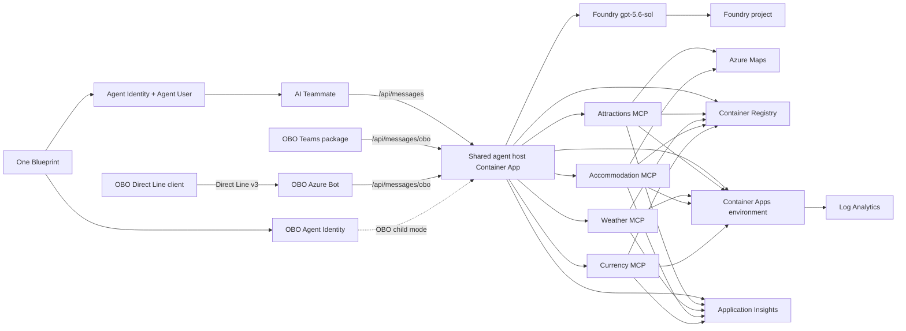

# Seoul Tourist Agent infrastructure

This directory contains two backend-owned deployment paths:

- `main.bicep` is the subscription-scope bootstrap and initial five-application deployment.
- `live-backend-container-apps-update.bicep` is the resource-group-scope wrapper for updating the
  five existing Container Apps without recreating shared infrastructure.

> M7 is active. This is the only infrastructure and deployment source; the frontend projects are
> channel-only frontends. The deployment commands below are historical and operational reference only;
> they are not authorization to deploy, read tenant state, change identities, or run Agent 365 CLI
> workflows from this backend.

## Architecture



Only `ca-agent-seoultour-dev-kc-ae23` has external ingress. The four MCP apps use internal
ingress and validate the shared delegated `Mcp.Invoke` scope. Agent identity is never the host
UAMI: `a365` owns the Blueprint, BlueprintPrincipal, and each Agent Identity/Agentic User.

## Bootstrap and initial deployment

The five `main.bicep` image parameters default to the public Container Apps placeholder. In this phase,
Container Apps have no ACR registry entries, no Key Vault references, and no production settings.
RBAC is created so it can propagate before application images start.

Key Vault remains provisioned for optional future provider secrets, but the active five-app deployment
does not reference Key Vault from any workload. Its inactive KTO/Open-Meteo/OpenWeather/Eximbank/
ForexRateAPI plumbing is retained as historical optional infrastructure and is not changed during M7.

After the deployment gate is approved, phase 1 uses the checked-in parameter file and supplies the
deploying user's object ID at invocation time:

```powershell
$deployerObjectId = az ad signed-in-user show --query id -o tsv
$tenantId = $env:AZURE_TENANT_ID
$deploymentSessionId = '<deployment-session-id>'
$deploymentActor = '<operator-or-automation-id>'
$deploymentCreatedAt = '<ISO-8601-timestamp>'
az deployment sub create `
  --name seoultour-dev-kc-ae23-infra `
  --location koreacentral `
  --template-file infra/main.bicep `
  --parameters '@infra/main.parameters.json' `
  --parameters deployerObjectId=$deployerObjectId tenantId=$tenantId `
  --parameters sessionId=$deploymentSessionId deployedBy=$deploymentActor createdAt=$deploymentCreatedAt
```

Build immutable application images from the backend project root. The MCP image uses four independent
targets from `Dockerfile.mcp`.

```powershell
$tag = '<immutable-tag>'
az acr build --registry crseoultourdevkcae23 --image "seoul-tourist-agent:$tag" --file Dockerfile .
az acr build --registry crseoultourdevkcae23 --image "seoul-tourist-attractions:$tag" --file Dockerfile.mcp --target attractions .
az acr build --registry crseoultourdevkcae23 --image "seoul-tourist-weather:$tag" --file Dockerfile.mcp --target weather .
az acr build --registry crseoultourdevkcae23 --image "seoul-tourist-accommodation:$tag" --file Dockerfile.mcp --target accommodation .
az acr build --registry crseoultourdevkcae23 --image "seoul-tourist-currency:$tag" --file Dockerfile.mcp --target currency .
```

Agent 365 setup state and package commands belong only to their respective channel frontend
projects. This backend never contains `.a365` state or runs `a365` commands. The CLI, not
Bicep, creates child identities and delegated consent; preserve the shared Blueprint, do not
hand-edit generated state, and never run `a365 cleanup blueprint` while any child frontend exists.

Phase 2 requires the shared Blueprint ID and OBO child ID. AI Teammate child IDs are dynamic and
arrive in signed activities. Attractions and accommodation use Azure Maps managed identity, weather
uses public Open-Meteo, and currency uses Frankfurter/ECB reference rates, so no provider secrets
are required for the active deployment.

All four MCP Container Apps keep one production replica warm. The host discovers and validates all
four contracts before the model call, so scale-to-zero cold starts can exceed the Teams/Copilot
channel deadline even when each service is otherwise healthy.

```powershell
$acr = 'crseoultourdevkcae23.azurecr.io'
$agent365AgentIds = @{
  agenticUser = ''
  onBehalfOf = $env:AGENT365_OBO_AGENT_ID
} | ConvertTo-Json -Compress
$agent365AgentPrincipalIds = @{
  agenticUser = ''
  onBehalfOf = $env:AGENT365_OBO_AGENT_PRINCIPAL_ID
} | ConvertTo-Json -Compress

az deployment sub create `
  --name seoultour-dev-kc-ae23-app `
  --location koreacentral `
  --template-file infra/main.bicep `
  --parameters '@infra/main.parameters.json' `
  --parameters deployerObjectId=$deployerObjectId tenantId=$tenantId `
  --parameters sessionId=$deploymentSessionId deployedBy=$deploymentActor createdAt=$deploymentCreatedAt `
  --parameters containerImage="$acr/seoul-tourist-agent:$tag" `
  --parameters attractionsImage="$acr/seoul-tourist-attractions:$tag" `
  --parameters weatherImage="$acr/seoul-tourist-weather:$tag" `
  --parameters accommodationImage="$acr/seoul-tourist-accommodation:$tag" `
  --parameters currencyImage="$acr/seoul-tourist-currency:$tag" `
  --parameters agent365BlueprintId="$env:AGENT365_BLUEPRINT_ID" `
  --parameters agent365AgentIds="$agent365AgentIds" `
  --parameters agent365AgentPrincipalIds="$agent365AgentPrincipalIds" `
  --parameters oboChannelAppId="$env:OBO_CHANNEL_APP_ID" `
  --parameters oboOAuthConnectionName='seoul-tourist-obo' `
  --parameters forexRateApiKey=''
```

## Existing-backend update workflow

M7 host or MCP updates use `live-backend-container-apps-update.bicep`, not the subscription bootstrap.
The wrapper requires immutable digest references for all five images and targets only the five
existing Container Apps. The current checkpoint is host revision `0000028`; revision `0000027` is
the verified host rollback, while all four MCP services remain on revision `0000005`. Exact digests
and sanitized evidence are recorded in
[`docs/milestones/M7-end-to-end-alignment.md`](../docs/milestones/M7-end-to-end-alignment.md).

Every candidate needs a new protected parameter set and a separately validated rollback parameter
set. Historical `.azure` plans and parameters are never current authority and never enter Git.

```powershell
az bicep build `
  --file infra/live-backend-container-apps-update.bicep `
  --outfile '<temporary-output-path>'

az deployment group validate `
  --resource-group '<resource-group>' `
  --template-file infra/live-backend-container-apps-update.bicep `
  --parameters '@<candidate-parameters.json>'

az deployment group what-if `
  --resource-group '<resource-group>' `
  --template-file infra/live-backend-container-apps-update.bicep `
  --parameters '@<candidate-parameters.json>' `
  --result-format FullResourcePayloads `
  --no-pretty-print
```

Review the structured result before approval: exactly five existing Container App modifications,
no creates or deletes, and every property delta explained. Reject identity, RBAC, SKU, location,
scale, ingress, route, audience, Blueprint, child-ID, secret, or unrelated drift. Validate the
rollback set through the same compile, ARM validation, and what-if boundary before deployment.

## Security and prerequisites

- Key Vault uses RBAC, soft delete, seven-day retention, and disabled public access. Active
  providers do not consume secrets. Purge protection is intentionally omitted.
- ACR admin and anonymous pull are disabled. All applications use UAMI-based AcrPull.
- Active providers use Azure managed identity or public, attributed APIs and require no provider keys.
- The host UAMI has AcrPull only. It has no direct Foundry, Purview, or MCP agent permission.
  Attractions and accommodation have Azure Maps Search and Render Data Reader. Other MCP workload
  roles are scoped to ACR.
- ACR and Key Vault diagnostics flow to `log-seoultour-dev-kc-ae23`. Application telemetry uses
  workspace-based Application Insights without local authentication.
- The MCP resource API is a separate application with a delegated `Mcp.Invoke` scope; it is not the
  agent application. A365 CLI owns Blueprint/Agent Identity permissions and consent.
- The two host routes use separate JWT schemes and channel app audiences. AI Teammate uses the
  shared Blueprint; OBO uses a single-tenant Azure Bot app. The SDK `ConnectionsMap` selects the
  matching outbound credential by incoming audience; downstream resource tokens remain child-bound.
- Both connection profiles use `FederatedCredentials`: the shared Blueprint is `ClientId` and the
  host UAMI is `FederatedClientId`. Agentic User auth resolves its child dynamically;
  `AgentIdentityObo.AgentId` selects the OBO child for `fmi_path` and child OBO.
- The Azure Bot OAuth connection `seoul-tourist-obo` must return an exchangeable user token for the
  delegated scope exposed by the shared Blueprint. Agent Framework must return that raw assertion;
  the host performs the child-bound parent-token and resource `/.default` exchanges explicitly.
- Review and minimize existing Blueprint Graph grants before creating the OBO child; inherited
  permissions are shared by design, even while WorkIQ is disabled in code.
- `Microsoft.Maps` must be registered before deployment. Provider registration is not performed by
  this scaffold.
- Agent 365 CLI 1.1.214 does not expose Foundry Azure RBAC assignment or binding this pre-created
  UAMI to the Blueprint FIC. Per-instance Foundry access and verified Blueprint federation are hard
  deployment gates; do not grant Foundry to the UAMI or duplicate Agent ID objects in Bicep.

## Validation

Compile without deploying:

```powershell
az bicep build --file infra/main.bicep --stdout > $null
az bicep build --file infra/live-backend-container-apps-update.bicep --stdout > $null
```

`live-backend-container-apps-update.json` is the checked-in compiled form of the resource-group
wrapper and must remain synchronized with its Bicep source. Compilation is local validation only;
deployment still requires fresh live validation, what-if review, rollback validation, and explicit
approval.
