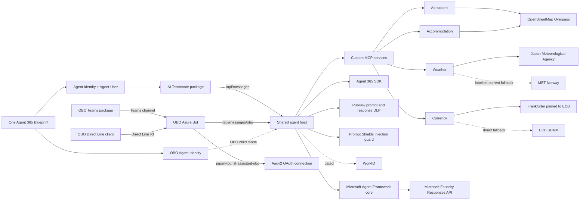

# Japan Tourist Expert Backend

A Microsoft-first C# shared backend for a Japan travel expert. Microsoft Agent Framework owns
orchestration, Agent 365 owns runtime identity and transport, Microsoft Purview protects prompt and
response content, and custom travel data is exposed through standalone MCP services. The OBO Teams,
OBO Direct Line, and AI Teammate frontend projects own their respective channel assets and
registration state.

## Architecture



The dependency direction is deliberate:

- [server/agent](server/agent) contains channel-independent instructions and agent construction.
- [server/agent-host](server/agent-host) owns transport, identity boundaries, sessions, Agent 365,
  and Purview integration.
- [server/integrations](server/integrations) encapsulates provider APIs and response mapping.
- [server/mcp](server/mcp) contains independently hostable HTTP MCP adapters.
- [contracts](contracts) contains the versioned, non-secret frontend-to-backend integration contract.
- [tools](tools) provides reusable validation for developers, automation, and coding agents.
- [tests](tests) exercises prompt safety, deterministic tools, and provider mapping without live calls.

## Deployment target

The fixed target is the shared `rg-a365-custom-agents` resource group. The Foundry account, its
`default` project, and the model deployment are referenced in place through the Foundry Responses API
and are never created by this repository. The host reaches the model through the Foundry **account**
endpoint plus `/openai/v1`; the project-scoped `/api/projects/<name>` form does not publish that
surface and must not be configured.

The agent host and the four MCP services run on immutable image digests, with the Azure Bot, Teams
channel, Direct Line site, and the `japan-tourist-assistant-obo` OAuth connection in place. OBO Teams
and OBO Direct Line have live, accepted turns covering Agent Identity resolution, fail-closed Purview,
all four MCP services, and the Foundry model call. AI Teammate has a built package but no live turn
yet.

Deployment uses the single-revision production
path only. See [the M8 migration record](docs/milestones/M8-japan-expert-migration.md). The
[M7 record](docs/milestones/M7-end-to-end-alignment.md) is historical Seoul evidence only.

## Milestones

The source of truth is [docs/milestones/milestones.json](docs/milestones/milestones.json), with the
human protocol in [docs/milestones/README.md](docs/milestones/README.md).

- **M0, complete:** architecture, Agent Framework foundation, MCP services, the then-bundled Teams
  package, validation tools, tests, and health automation.
- **M1, complete:** governed Agent 365 onboarding and fail-closed Purview protection.
- **M2, blocked:** its historical production-governance and IRM checklist is preserved.
- **M3, blocked:** its resilience and diagnostics backlog remains preserved.
- **M4, reserved:** no M4 milestone was defined; the numbering gap is intentional.
- **M5, blocked:** its historical rollout record remains preserved.
- **M6, complete:** non-destructive extraction of this OBO-seeded backend and its frontend contract.
- **M7, blocked:** historical Seoul cross-channel alignment and production checkpoint.
- **M8, active:** Japan Tourist Expert source migration, Japan MCP retune, single-resource-group deployment,
  clean Agent 365 registration, and same-revision cross-channel acceptance.

The three channel frontends consume two protected host modes: AI Teammate uses `/api/messages`, while
OBO Teams and OBO Direct Line share `/api/messages/obo`. The two modes share one Blueprint and backend
but have separate child Agent Identities, token audiences, packages, session keys, and CLI state. M8
preserves those boundaries while creating new Japan Tourist Expert identities rather than reusing Seoul
state. Custom MCP arguments/results remain behind the fail-closed Purview guard.
WorkIQ remains disabled because Agent 365 Tooling 1.0 targets an MCP preview API incompatible with the
MCP 2.1 client.

## Documentation map

- Governance and release: [backend instructions](AGENTS.md), [contribution guide](CONTRIBUTING.md),
  [security policy](SECURITY.md), and
  [public-release checklist](docs/public-release-checklist.md).
- Architecture and configuration: [secure configuration](docs/configuration.md),
  [infrastructure](infra/README.md), [validation tools](tools/README.md), and the
  [disabled WorkIQ boundary](server/mcp/workiq/README.md).
- Operations: [diagnostics contract](docs/operations/diagnostics.md),
  [failure matrix](docs/operations/failure-matrix.md), and
  [troubleshooting](docs/operations/troubleshooting.md).
- Milestones: [protocol](docs/milestones/README.md), [M2 governance](docs/milestones/M2-obo-governance.md),
  [M3 hardening](docs/milestones/M3-code-hardening.md),
  [M5 rollout](docs/milestones/M5-production-rollout.md),
  [M6 separation](docs/milestones/M6-repository-separation.md),
  [M6 deployment handoff](docs/milestones/M6-backend-deployment-test-handoff.md), and
  [M7 historical alignment](docs/milestones/M7-end-to-end-alignment.md), and
  [M8 Japan Tourist Expert migration](docs/milestones/M8-japan-expert-migration.md).
- Repository transition:
  [M7 frontend/backend cleanup](docs/migrations/M7-frontend-backend-cleanup.md).

## Microsoft Stack

- .NET 10 and C#
- Microsoft Agent Framework (`Microsoft.Agents.AI`)
- Agent 365 runtime, tooling boundary, identity context, and Microsoft OpenTelemetry
- Microsoft Foundry Responses API on the account endpoint, using per-turn Agent Identity tokens
- `Microsoft.Agents.AI.Purview` prompt and response middleware
- Active providers: OpenStreetMap Overpass for attractions and accommodation; JMA for forecasts and
  alerts with a clearly labelled MET Norway current-conditions fallback; Frankfurter pinned to ECB
  with direct ECB SDMX fallback
- Official Model Context Protocol C# SDK
- MSTest

## Build And Test

```powershell
dotnet build JapanExpertAgent.slnx
dotnet test JapanExpertAgent.slnx
./tools/Invoke-Validation.ps1
./tools/Invoke-LocalCi.ps1
./tools/tests/Invoke-ToolsSelfTest.ps1
```

The solution builds and tests without tenant or provider credentials. Live calls require the
corresponding identity, subscription, approval, or API key. See
[docs/configuration.md](docs/configuration.md) before running a live service.

For production diagnosis and safe evidence collection, see
[docs/operations/troubleshooting.md](docs/operations/troubleshooting.md).

## Validation Tools

All scripts default to offline or local read-only checks. Use `-OutputFormat Json` for automation and
agents. Online checks require explicit switches and never log in, create resources, grant consent,
change policies, run Agent 365 setup, or publish.

```powershell
./tools/Test-Prerequisites.ps1
./tools/Test-Repository.ps1
./tools/Test-Azure.ps1 -Online
./tools/Test-Purview.ps1
./tools/Invoke-Validation.ps1 -OutputFormat Json
```

See [tools/README.md](tools/README.md) for parameters, exit codes, and tenant-safe usage.

## Local Services

The checked-in non-secret model configuration targets the existing `a365-ai-foundry` **account**
endpoint and the `gpt-5.6-sol` deployment through the Responses API. The setting is named
`FoundryProjectEndpoint` for compatibility, but its value must be the account endpoint; the
project-scoped `/api/projects/<name>` form does not publish `/openai/v1` and fails at run time.
Override configuration through environment
variables or user secrets; never add a bearer token or API key to an appsettings file.

```powershell
# Authenticate with a local developer credential recognized by DefaultAzureCredential first.
dotnet run --project server/agent-host/JapanExpert.AgentHost --launch-profile Playground
```

The host preserves `/api/health` for existing liveness probes and also exposes
`/api/health/live` and `/api/health/ready`. Readiness proves local startup and validated
configuration only; it does not call tenants, providers, Purview, or user-token flows. It reports
`Degraded` while process-local `MemoryStorage` is active; do not scale out until a durable storage
implementation is selected in a deployment milestone.

Configure each credential-free MCP independently:

```powershell
$env:Overpass__Endpoint = "https://overpass-api.de/api/interpreter"
$env:Jma__ForecastBaseAddress = "https://www.jma.go.jp/bosai/forecast/data/forecast/"
$env:Jma__AlertFeedAddress = "https://www.data.jma.go.jp/developer/xml/feed/extra.xml"
$env:MetNorway__BaseAddress = "https://api.met.no/weatherapi/locationforecast/2.0/"
$env:Frankfurter__Enabled = "true"
$env:Frankfurter__BaseAddress = "https://api.frankfurter.dev/v2/"
$env:Frankfurter__Providers = "ECB"
$env:EcbSdmx__Enabled = "true"
$env:EcbSdmx__BaseAddress = "https://data-api.ecb.europa.eu/service/data/EXR/"

dotnet run --project server/mcp/attractions/JapanExpert.Mcp.Attractions --launch-profile http
dotnet run --project server/mcp/weather/JapanExpert.Mcp.Weather --launch-profile http
dotnet run --project server/mcp/accommodation/JapanExpert.Mcp.Accommodation --launch-profile http
dotnet run --project server/mcp/currency/JapanExpert.Mcp.Currency --launch-profile http
```

The local endpoints are listed in [.vscode/mcp.json](.vscode/mcp.json). Currency retains the
deterministic caller-supplied-rate tool and also provides attributed live/reference-rate tools.

## Agent 365 And Purview

Agent 365 generated configuration, `ToolingManifest.json`, and published packages containing real
IDs are owned by the frontend projects. They must never be fabricated, hand-edited, copied into
this backend, or read by backend CI. The route, audience, health, and MCP boundaries for the two
protected host modes consumed by all three frontends are defined in
[contracts/frontend-backend-contract.json](contracts/frontend-backend-contract.json).

Purview must protect textual ingress and egress before content reaches the model or channel, fail
closed when policy evaluation fails, and keep sensitive telemetry disabled. Agent Framework Purview
middleware does not automatically cover system instructions, MCP/WorkIQ tool arguments and results,
binary content, logs, or telemetry. Custom MCP arguments and results therefore use a separate
fail-closed Purview guard. WorkIQ remains disabled until Microsoft publishes Agent 365 Tooling
compatible with MCP 2.1 and its generated tools pass the same guard.

### Prompt Shields injection guard

Purview answers "does this content violate a data protection policy?". It does not answer "is this
content trying to hijack the agent?". Azure AI Content Safety Prompt Shields answers the second
question, and both run on every turn through `CompositeToolContentEvaluator` — either can reject.

`PromptShieldGuard` screens the user prompt before any model or tool call, and screens tool
**results** through `PromptShieldToolContentEvaluator`. Results are the indirect-injection vector: a
hostile instruction planted in an upstream description would otherwise reach the model as trusted
grounding. Arguments are not re-screened because the model derives them from an already-screened
prompt.

The guard is fail-closed on every path — a detected attack, a transport error, a non-success status,
an unparsable body, or content needing more segments than allowed all stop the turn. It
authenticates with a per-turn child Agent Identity token on
`https://cognitiveservices.azure.com/.default`, so no Content Safety key exists in the deployment,
and because Prompt Shields never sees the model it keeps working if inference moves outside Azure.

No extra Azure resource is needed: the existing multi-service `AIServices` account already publishes
the Content Safety surface. The guard is on by default; see
[docs/configuration.md](docs/configuration.md) for the settings and the role it needs.

Each protected turn receives a fresh Purview wrapper so protection-scope and ETag state is never
shared across requests. The host registry retains created wrappers long enough for background audit
work and disposes them once during application shutdown; callers must not cache or dispose a wrapper
per turn.

## Docker

The root [Dockerfile](Dockerfile) publishes the shared Agent 365 host as a multi-stage .NET 10 image, runs
as the built-in non-root user, and listens on port `8080`.

```powershell
docker build --tag japan-expert-agent:local .
docker build --file Dockerfile.mcp --target attractions --tag japan-expert-attractions:local .
docker build --file Dockerfile.mcp --target weather --tag japan-expert-weather:local .
docker build --file Dockerfile.mcp --target accommodation --tag japan-expert-accommodation:local .
docker build --file Dockerfile.mcp --target currency --tag japan-expert-currency:local .
docker run --rm --publish 8080:8080 `
  --env ASPNETCORE_ENVIRONMENT=Development `
  japan-expert-agent:local
Invoke-RestMethod http://localhost:8080/api/health
```

For Azure, keep `ASPNETCORE_ENVIRONMENT=Production` and token validation enabled. The host UAMI owns
ACR pull and Blueprint federation only; the effective child runtime identities receive the minimum
Foundry model data-plane role. Supply Purview and identity values through protected deployment
configuration as described in [docs/configuration.md](docs/configuration.md). The image contains no
credential material.
Only this host image needs rebuilding for a two-route host change. The four independently hosted MCP
images can remain deployed unless their own code or shared authorization contract changes.

## Frontend Contract

The OBO Teams, OBO Direct Line, and AI Teammate frontend projects each pin the non-secret contract
version and own their channel validation or package registration. Backend deployment receives Blueprint
and child identity values only through protected configuration, never from frontend source or generated
state.

The root [`contract-alignment-ci.yml`](../.github/workflows/contract-alignment-ci.yml) workflow
compares every frontend lock with
[`frontend-backend-contract.json`](contracts/frontend-backend-contract.json). The root
[`backend-ci.yml`](../.github/workflows/backend-ci.yml) workflow rejects tracked
frontend/operational residue and runs this project's local CI gate.
