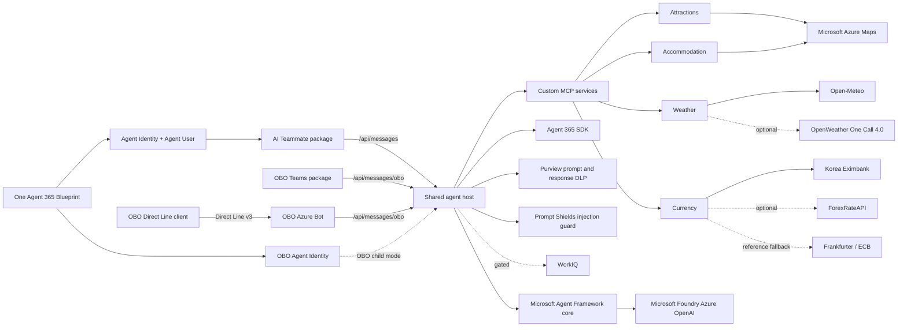

# Korea Tourist Expert Backend

A Microsoft-first C# shared backend for a Korea travel assistant. Microsoft Agent Framework owns
orchestration, Agent 365 owns runtime identity and transport, Microsoft Purview protects prompt and
response content, and custom travel data is exposed through standalone MCP services. The OBO Teams,
OBO Direct Line, and AI Teammate frontend projects own their respective channel assets and
registration state.

This project is the **only** source authority for runtime code, deployment configuration, and
infrastructure. Frontends own channel contracts and packages; they never own backend configuration.

## Architecture



The dependency direction is deliberate:

- [server/agent](server/agent) contains channel-independent instructions and agent construction.
- [server/agent-host](server/agent-host) owns transport, identity boundaries, sessions, Agent 365,
  and Purview integration.
- [server/integrations](server/integrations) encapsulates provider APIs and response mapping.
- [server/mcp](server/mcp) contains independently hostable HTTP MCP adapters.
- [contracts](contracts) contains the versioned, non-secret frontend-to-backend integration contract.
- [tools](tools) provides reusable validation for developers, automation, and coding agents.
- [tests](tests) exercises prompt safety, deterministic tools, and provider mapping without live calls.

Nothing in `server/agent`, `server/integrations`, or `server/mcp` references the host, and no
integration references another integration. Only the host composes them.

### Solution layout

[`KoreaExpertAgent.slnx`](KoreaExpertAgent.slnx) contains 19 projects — 11 under `server/`, 8 under
`tests/`:

| Area | Projects |
| --- | --- |
| Agent core | `KoreaExpert.Agent` |
| Host | `KoreaExpert.AgentHost` |
| Integrations | `KoreaExpert.AzureMaps`, `KoreaExpert.ExchangeRates`, `KoreaExpert.Tourism`, `KoreaExpert.Weather` |
| MCP services | `KoreaExpert.Mcp.Hosting`, `KoreaExpert.Mcp.Attractions`, `KoreaExpert.Mcp.Weather`, `KoreaExpert.Mcp.Accommodation`, `KoreaExpert.Mcp.Currency` |
| Tests | `KoreaExpert.Agent.Tests`, `KoreaExpert.AgentHost.Tests`, `KoreaExpert.AzureMaps.Tests`, `KoreaExpert.ExchangeRates.Tests`, `KoreaExpert.Mcp.Currency.Tests`, `KoreaExpert.Mcp.Hosting.Tests`, `KoreaExpert.Tourism.Tests`, `KoreaExpert.Weather.Tests` |

Build settings are centralized: [`global.json`](global.json) pins SDK `10.0.110` with
`rollForward: latestPatch` and `allowPrerelease: false`; [`Directory.Build.props`](Directory.Build.props)
sets `TreatWarningsAsErrors=true` and `AnalysisLevel=latest-recommended`;
[`Directory.Packages.props`](Directory.Packages.props) is the single Central Package Management
manifest for every package version in the solution.

Because warnings are errors, a clean build is a real gate — the current tree builds
**0 warnings / 0 errors** and the suite runs **135 tests, 0 failed, 0 skipped**.

## Current production checkpoint

The active M7 host is revision `0000028` at immutable digest
`sha256:161f9b8fa401012d5d87ccef1c215c23515709850496f585e0aca66f93b1f771`, healthy and receiving
100% of host traffic. Revision `0000027`, digest
`sha256:9dd1e4d22f824504c375cd112da36b8b25ace68aa4b8e23af12dd0de2a09004c`, is the validated rollback
boundary. The four MCP services remain healthy on revision `0000005` and their approved immutable
digests.

Revision `0000028` creates a distinct Purview-wrapped chat client for every protected turn and keeps
created clients alive only for background content-activity completion, disposing them once at host
shutdown. Isolated Direct Line acceptance proved pre-model blocks for approved synthetic credit-card,
South Korean passport, and resident-registration cases with zero model requests in the covered
interval. See [the M7 record](docs/milestones/M7-end-to-end-alignment.md) for sanitized evidence and
remaining same-revision channel gates. This checkpoint is not standing deployment authorization.

## Milestones

The source of truth is [docs/milestones/milestones.json](docs/milestones/milestones.json), validated
against [milestones.schema.json](docs/milestones/milestones.schema.json), with the human protocol in
[docs/milestones/README.md](docs/milestones/README.md). The file declares `protocolVersion: 1` and
`currentMilestone: "M7"`.

- **M0, complete:** architecture, Agent Framework foundation, MCP services, the then-bundled Teams
  package, validation tools, tests, and health automation.
- **M1, complete:** governed Agent 365 onboarding and fail-closed Purview protection. Its
  `activationPhrase` was `Start milestone M1`.
- **M2, blocked:** its historical production-governance and IRM checklist is preserved; fresh
  cross-channel and Purview alignment now belongs to M7.
- **M3, blocked:** its resilience and diagnostics backlog remains preserved.
- **M5, blocked:** its historical rollout record remains preserved; fresh deployment and live
  acceptance evidence now belongs to M7.
- **M6, complete:** non-destructive extraction of this OBO-seeded backend and its frontend contract.
- **M7, active:** 100% code, contract, infrastructure, deployment, and channel alignment with this
  backend project as the only shared runtime and deployment source.

The three channel frontends consume two protected host modes: AI Teammate uses `/api/messages`, while
OBO Teams and OBO Direct Line share `/api/messages/obo`. The two modes share one Blueprint and backend
but have separate child Agent Identities, token audiences, packages, session keys, and CLI state. M7
requires zero unexplained drift between canonical backend behavior, the deployed revision, and all
three frontend contracts while preserving those ownership and isolation boundaries.
Custom MCP arguments/results have passing DLP evidence.
WorkIQ remains disabled because Agent 365 Tooling 1.0 targets an MCP preview API incompatible with the
MCP 2.1 client.

## Microsoft Stack

- .NET 10 and C#
- Microsoft Agent Framework (`Microsoft.Agents.AI` 1.17.0)
- Agent 365 runtime (`Microsoft.Agents.A365.Runtime` 1.0.0), builder/core/authentication `1.4.83`,
  identity context, and Microsoft OpenTelemetry (`Microsoft.OpenTelemetry` 1.0.7)
- Microsoft Foundry Azure OpenAI with `DefaultAzureCredential`
- `Microsoft.Agents.AI.Purview` 1.17.0-rc1 prompt and response middleware
- Official Model Context Protocol C# SDK 2.1.0 (`ModelContextProtocol`, `ModelContextProtocol.AspNetCore`)
- MSTest 4.0.1
- Active providers: Azure Maps for attractions and accommodation; Open-Meteo with optional OpenWeather
  fallback; deployed currency uses Frankfurter/ECB, with Korea Eximbank and ForexRateAPI available as
  configurable higher-priority fallbacks
- KTO TourAPI Service2 adapter is compiled and tested but is not wired into the active attractions MCP

`Microsoft.Bcl.Memory` is pinned to `10.0.10` as a deliberate transitive security override.

## Build And Test

```powershell
dotnet build KoreaExpertAgent.slnx
dotnet test KoreaExpertAgent.slnx
./tools/Invoke-Validation.ps1
./tools/Invoke-LocalCi.ps1
./tools/tests/Invoke-ToolsSelfTest.ps1
```

The solution builds and tests without tenant or provider credentials. Live calls require the
corresponding identity, subscription, approval, or API key. See
[docs/configuration.md](docs/configuration.md) before running a live service.

Current per-assembly test counts:

| Test project | Tests |
| --- | --- |
| `KoreaExpert.AgentHost.Tests` | 93 |
| `KoreaExpert.Mcp.Hosting.Tests` | 10 |
| `KoreaExpert.Weather.Tests` | 9 |
| `KoreaExpert.ExchangeRates.Tests` | 6 |
| `KoreaExpert.Mcp.Currency.Tests` | 4 |
| `KoreaExpert.Agent.Tests` | 3 |
| `KoreaExpert.Tourism.Tests` | 3 |
| `KoreaExpert.AzureMaps.Tests` | 2 |
| **Total** | **135** |

For production diagnosis and safe evidence collection, see
[docs/operations/troubleshooting.md](docs/operations/troubleshooting.md),
[docs/operations/diagnostics.md](docs/operations/diagnostics.md), and
[docs/operations/failure-matrix.md](docs/operations/failure-matrix.md).

## Validation Tools

All scripts default to offline or local read-only checks. Use `-OutputFormat Json` for automation and
agents. Online checks require explicit switches and never log in, create resources, grant consent,
change policies, run Agent 365 setup, or publish.

```powershell
./tools/Test-Prerequisites.ps1
./tools/Test-Repository.ps1
./tools/Test-Azure.ps1 -Online
./tools/Test-Purview.ps1
./tools/Invoke-Validation.ps1 -OutputFormat Json
```

See [tools/README.md](tools/README.md) for parameters, exit codes, and tenant-safe usage.

## Continuous integration

Five workspace-level GitHub workflows live in [`.github/workflows`](../.github/workflows). All run on
`windows-latest` with `permissions: contents: read` and no cloud login:

| Workflow | Timeout | What it enforces |
| --- | --- | --- |
| `backend-ci.yml` | 25 min | .NET SDK `10.0.110`, then `./tools/Invoke-LocalCi.ps1 -Configuration Release` |
| `ai-teammate-ci.yml` | 10 min | AI Teammate contract pin; fails with `Invalid AI Teammate backend contract pin.` |
| `obo-teams-ci.yml` | 10 min | OBO Teams contract pin; fails with `Invalid OBO backend contract pin.` |
| `direct-line-ci.yml` | 10 min | Direct Line build/test plus a credential scan rejecting `client_key.key`, `*.key`, `*.pem`, `*.pfx` |
| `contract-alignment-ci.yml` | 5 min | Compares all three `backend-contract.lock.json` files against `contracts/frontend-backend-contract.json` |

## Host surface

[`server/agent-host/KoreaExpert.AgentHost`](server/agent-host/KoreaExpert.AgentHost) is composed in
`Program.cs` and exposes:

| Route | Auth | Purpose |
| --- | --- | --- |
| `POST /api/messages` | JWT, `TokenValidation__Audiences__AgenticUser` | AI Teammate channel, `dynamic-child-agent-identity` |
| `POST /api/messages/obo` | JWT, `TokenValidation__Audiences__OnBehalfOf` | OBO Teams and Direct Line, `configured-obo-child-agent-identity` |
| `GET /api/health` | anonymous | Aggregate health, preserved for existing probes |
| `GET /api/health/live` | anonymous | `live`-tagged checks only |
| `GET /api/health/ready` | anonymous | `ready`-tagged checks only |
| `GET /`, `/privacy`, `/terms` | anonymous | Static channel-required pages |
| `POST /internal/purview/{**path}` | loopback only | Compatibility proxy for Purview Graph calls |

All health responses are rendered by `AgentHealthResponseWriter`. Readiness proves local startup and
validated configuration only; it does not call tenants, providers, Purview, or user-token flows.
It reports `Degraded` because `readinessState.MarkReady(hasDurableStorage: false)` records that
process-local `MemoryStorage` is active — do not scale out until a durable storage implementation is
selected in a deployment milestone.

Startup is fail-fast. Every options class is registered with `.ValidateDataAnnotations()`, a custom
`.Validate(...)` predicate, and `.ValidateOnStart()`, so a misconfigured host refuses to start rather
than failing mid-turn. WorkIQ is enforced in code, not merely by configuration: its options gate is
`.Validate(options => !options.EnableWorkIq, ...)`, so setting `EnableWorkIq=true` aborts startup.

Four Agent 365 authentication handlers are configured in
[`appsettings.json`](server/agent-host/KoreaExpert.AgentHost/appsettings.json): `agentic-foundry`,
`agentic-purview`, `agentic-mcp`, and `obo-user`. The checked-in non-secret defaults include
Foundry deployment and model `gpt-5.6-sol`, `MaximumPromptCharacters: 32768`, `EnableWorkIq: false`,
`InternalMcp.Enabled: false`, and `PurviewDlp.Enabled: true`.

`KoreaExpertApplication` derives from `AgentApplication` and takes 18 constructor dependencies,
including `AgentChatClientFactory`, `InternalMcpToolCatalog`, `AgentTurnCoordinator`,
`AgentFrontendIdentityBinding`, `AgentIdentityTokenContext`, `ToolUserContext`,
`IExporterTokenCache<string>`, and `IAgentIdentityOboTokenExchange`. It emits A365 Observability
tracing scopes for each turn.

## Local Services

The checked-in non-secret model configuration targets deployment `gpt-5.6-sol` at the supplied
Microsoft Foundry Azure OpenAI endpoint. Override configuration through environment variables or
user secrets; never add a bearer token or API key to an appsettings file.

```powershell
# Authenticate with a local developer credential recognized by DefaultAzureCredential first.
dotnet run --project server/agent-host/KoreaExpert.AgentHost --launch-profile Playground
```

`Development` and `Playground` are both treated as local environments by the host.

Configure each MCP independently. These placeholders are intentionally not usable credentials:

```powershell
$env:AzureMaps__ClientId = "<azure-maps-client-id-for-this-service>"
$env:OpenMeteo__BaseAddress = "https://customer-api.open-meteo.com/v1/"
$env:OpenMeteo__ApiKey = "<commercial-open-meteo-key>"
$env:OpenMeteo__RequireCommercialLicense = "true"
$env:KoreaEximbank__Enabled = "true"
$env:KoreaEximbank__AuthKey = "<korea-eximbank-key>"
$env:ForexRateApi__Enabled = "true"
$env:ForexRateApi__ApiKey = "<optional-forexrateapi-key>"
$env:Frankfurter__Enabled = "true"
$env:Frankfurter__BaseAddress = "https://api.frankfurter.dev/v1/"

dotnet run --project server/mcp/attractions/KoreaExpert.Mcp.Attractions --launch-profile http
dotnet run --project server/mcp/weather/KoreaExpert.Mcp.Weather --launch-profile http
dotnet run --project server/mcp/accommodation/KoreaExpert.Mcp.Accommodation --launch-profile http
dotnet run --project server/mcp/currency/KoreaExpert.Mcp.Currency --launch-profile http
```

Local MCP loopback ports are `3981` attractions, `3982` weather, `3983` accommodation, and `3984`
currency, each serving `/mcp`. Editor MCP wiring lives in `.vscode/mcp.json`, which is intentionally
gitignored — recreate it locally from those ports if your editor needs it.

Currency retains the deterministic caller-supplied-rate tool and also provides attributed
live/reference-rate tools. The currency service registers two tool classes and refuses to start
unless at least one rate provider is enabled.

## MCP contract

The host does not trust MCP servers by discovery. `InternalMcpToolCatalog` pins **seven tools across
four servers** and verifies, on connect, name-set equality, ordinal description match, parameter and
required-parameter set equality, and a canonical SHA-256 schema fingerprint. Any drift fails closed.

| Server | Tool | Parameters | Required |
| --- | --- | --- | --- |
| attractions | `search_korea_attractions` | `query, latitude, longitude, radiusMeters, limit` | `query` |
| weather | `get_korea_current_weather` | `latitude, longitude` | — |
| weather | `get_korea_weather_forecast` | `latitude, longitude, days` | — |
| weather | `get_korea_weather_alerts` | `latitude, longitude` | — |
| accommodation | `search_korea_accommodation` | `query, latitude, longitude, radiusMeters, limit` | — |
| currency | `convert_currency_with_rate` | `amount, sourceCurrency, targetCurrency, exchangeRate, rateObservedAt` | `amount, sourceCurrency, targetCurrency, exchangeRate` |
| currency | `get_exchange_rate` | `sourceCurrency, targetCurrency, date` | `sourceCurrency, targetCurrency` |
| currency | `convert_currency` | `amount, sourceCurrency, targetCurrency, date` | `amount, sourceCurrency, targetCurrency` |

`get_korea_current_weather` and `get_korea_weather_alerts` share a fingerprint because their schemas
are byte-identical; that is expected, not a collision. An unrecognized server name throws
`ArgumentOutOfRangeException` with `"Unknown internal MCP server."`

Tool defaults and ranges: Seoul City Hall `37.5665, 126.9780`; radius `100..50000` m; result limit
`1..20`; forecast `1..16` days.

Client transport is `HttpClientTransport` with `HttpTransportMode.StreamableHttp` and
`Stateless = true`. Every MCP service applies the same hardening: `RemoveAllLoggers()`, a 20-second
request timeout, and a 1 MiB response cap.

`InternalMcpOptions` (section `InternalMcp`) controls the surface: `Enabled`, `UseAuthentication`
(default `true`), `Audience` (must use the `api` scheme), the four endpoint URLs, and
`MaximumContentCharacters` (`[Range(1024, 262144)]`, default `65536`). The delegated scope is derived
from the audience via `AgentIdentityAuthorizationScopes.InternalMcp(...)`.

## Agent 365 And Purview

Agent 365 generated configuration, `ToolingManifest.json`, and published packages containing real
IDs are owned by the frontend projects. They must never be fabricated, hand-edited, copied into
this backend, or read by backend CI. The route, audience, health, and MCP boundaries for the two
protected host modes consumed by all three frontends are defined in
[contracts/frontend-backend-contract.json](contracts/frontend-backend-contract.json).

Purview must protect textual ingress and egress before content reaches the model or channel, fail
closed when policy evaluation fails, and keep sensitive telemetry disabled. Agent Framework Purview
middleware does not automatically cover system instructions, MCP/WorkIQ tool arguments and results,
binary content, logs, or telemetry. Custom MCP arguments and results therefore use a separate
fail-closed Purview guard. WorkIQ remains disabled until Microsoft publishes Agent 365 Tooling
compatible with MCP 2.1 and its generated tools pass the same guard.

That separate guard is `ToolContentProtector`. It wraps `FunctionInvocationContext` and evaluates
**both directions** of every tool call:

1. Resolve the caller via `ToolUserContext.RequireUserId()` — no anonymous tool execution.
2. Serialize the arguments, enforce `MaximumContentCharacters`, and evaluate them as
   `ToolContentDirection.Arguments`.
3. Invoke the tool only if evaluation passed.
4. Serialize the result, enforce the same cap, and evaluate it as `ToolContentDirection.Result`.

`IToolContentEvaluator.EvaluateAsync` throws to block; there is no permissive path. Content exceeding
the character cap is rejected rather than truncated, so an oversized payload cannot slip past policy
evaluation.

### Prompt Shields injection guard

Purview answers "does this content violate a data protection policy?". It does not answer "is this
content trying to hijack the agent?". Azure AI Content Safety Prompt Shields answers the second
question, and both run on every turn through `CompositeToolContentEvaluator` — either can reject.

`PromptShieldGuard` screens the user prompt before any model or tool call, and screens tool
**results** through `PromptShieldToolContentEvaluator`. Results are the indirect-injection vector: a
hostile instruction planted in an upstream description would otherwise reach the model as trusted
grounding. Arguments are not re-screened because the model derives them from an already-screened
prompt.

The guard is fail-closed on every path — a detected attack, a transport error, a non-success status,
an unparsable body, or content needing more segments than allowed all stop the turn. It
authenticates with a per-turn child Agent Identity token on
`https://cognitiveservices.azure.com/.default`, so no Content Safety key exists in the deployment,
and because Prompt Shields never sees the model it keeps working if inference moves outside Azure.

No extra Azure resource is needed: the existing multi-service `AIServices` account already publishes
the Content Safety surface. The guard is on by default; see
[docs/configuration.md](docs/configuration.md) for the settings and the role it needs.

Each protected turn receives a fresh Purview wrapper so protection-scope and ETag state is never
shared across requests. The host registry retains created wrappers long enough for background audit
work and disposes them once during application shutdown; callers must not cache or dispose a wrapper
per turn. `PurviewSerializationWorkaround.Apply()` is invoked during startup to correct SDK
serialization behavior.

## Docker

The root [Dockerfile](Dockerfile) publishes the shared Agent 365 host as a multi-stage .NET 10 image, runs
as the built-in non-root user (`USER $APP_UID`), listens on port `8080`, and sets
`DOTNET_EnableDiagnostics=0`. Its build stage uses SDK `10.0.302` rather than the pinned `10.0.110`
because Microsoft Container Registry does not publish the VS-serviced patch; the runtime image is
`aspnet:10.0`.

[Dockerfile.mcp](Dockerfile.mcp) builds all four MCP images from one file: a shared `source` stage,
four per-service build stages, a shared `runtime` stage with `ASPNETCORE_HTTP_PORTS=8080`, and four
named final targets.

```powershell
docker build --tag korea-expert-agent:local .
docker build --file Dockerfile.mcp --target attractions --tag korea-expert-attractions:local .
docker build --file Dockerfile.mcp --target weather --tag korea-expert-weather:local .
docker build --file Dockerfile.mcp --target accommodation --tag korea-expert-accommodation:local .
docker build --file Dockerfile.mcp --target currency --tag korea-expert-currency:local .
docker run --rm --publish 8080:8080 `
  --env ASPNETCORE_ENVIRONMENT=Development `
  korea-expert-agent:local
Invoke-RestMethod http://localhost:8080/api/health
```

For Azure, keep `ASPNETCORE_ENVIRONMENT=Production` and token validation enabled. The host UAMI owns
ACR pull and Blueprint federation only; the effective child runtime identities receive the minimum
Foundry model data-plane role. Supply Purview and identity values through protected deployment
configuration as described in [docs/configuration.md](docs/configuration.md). The image contains no
credential material.
Only this host image needs rebuilding for a two-route host change. The four independently hosted MCP
images can remain deployed unless their own code or shared authorization contract changes.

## Infrastructure

Bicep templates and the deployment workflow live in [infra/](infra) — 21 modules, a
subscription-scope `main.bicep`, and a resource-group-scope `live-backend-container-apps-update.bicep`
for updating the already-deployed backend without re-running the full stack. See
[infra/README.md](infra/README.md).

## Frontend Contract

The OBO Teams, OBO Direct Line, and AI Teammate frontend projects each pin the non-secret contract
version and own their channel validation or package registration. Backend deployment receives Blueprint
and child identity values only through protected configuration, never from frontend source or generated
state.

[`contracts/frontend-backend-contract.json`](contracts/frontend-backend-contract.json) declares
`contractId: korea-expert-shared-backend`, `contractVersion: 1.0.0`, both frontend bindings, the
three health endpoints, and the MCP boundary (`serviceCount: 4`, `transport: streamable-http`,
`authorization: delegated Mcp.Invoke`). Each frontend repeats the matching subset in its own
`backend-contract.lock.json`; `contract-alignment-ci.yml` fails the build if any of them drifts.
