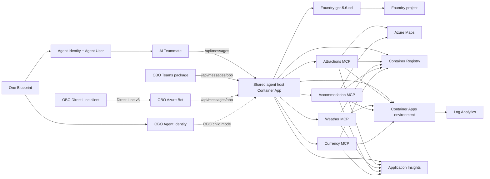

# Korea Tourist Expert infrastructure

This directory contains two backend-owned deployment paths:

- `main.bicep` is the resource-group-scope deployment of the five applications and their shared
  infrastructure.
- `live-backend-container-apps-update.bicep` is the resource-group-scope wrapper for updating the
  five existing Container Apps without recreating shared infrastructure.

Korea Tourist Expert deploys into the shared resource group `rg-a365-custom-agents` in
`koreacentral`, alongside Japan Tourist Expert in the same subscription. Every resource name
derives from `resourceBaseName` (`koreaexpert`), and Japan's names derive from `japanexpert`, so the
two products co-exist in one group with no collision and each can be redeployed on its own.
`main.bicep` never creates the resource group, and it refuses to deploy into any group other than
`targetResourceGroupName`.

The existing `a365-ai-foundry` account, its `default` project, and the `gpt-5.6-sol` deployment in
`rg-ai-foundry` are shared with Japan Tourist Expert and referenced in place. This template never creates,
moves, or changes Foundry, and Korea Tourist Expert does not provision a Foundry account of its own.

### Create the resource group first

The target group is a prerequisite, not something this template provisions:

```powershell
az group create --name rg-a365-custom-agents --location koreacentral
```

> **Read the whole runbook before running any of it.** This is the only infrastructure and deployment
> source; the frontend projects are channel-only. The commands below create and modify real Azure and
> Microsoft Entra objects. Run the compile, ARM validation, and structured what-if first, and confirm
> the rollback boundary before any mutation.

## Files

| Path | Role |
| --- | --- |
| `main.bicep` | `targetScope = 'resourceGroup'`; deploys into the existing shared resource group and orchestrates all modules |
| `main.parameters.json` | Checked-in non-secret parameters: `targetResourceGroupName` `rg-a365-custom-agents`, `resourceBaseName` `koreaexpert`, `location` `koreacentral`, the shared Foundry references, and placeholder provenance values |
| `live-backend-container-apps-update.bicep` | `targetScope = 'resourceGroup'`; updates only the five existing Container Apps |
| `live-backend-container-apps-update.json` | Checked-in compiled ARM form of the wrapper; must stay synchronized with its Bicep source |
| `bicepconfig.json` | Linter and analyzer configuration for both templates |
| `modules/` | 21 single-purpose modules; see the inventory below |

### Module inventory

All 21 modules are `.bicep` files under `modules/`:

| Group | Modules |
| --- | --- |
| Platform | `log-analytics`, `application-insights`, `container-registry`, `key-vault`, `container-app-environment` |
| Data plane | `azure-maps` |
| Foundry | `foundry-resource`, `foundry-project`, `foundry-model-deployment` |
| Identity | `host-managed-identity`, `attractions-managed-identity`, `weather-managed-identity`, `accommodation-managed-identity`, `currency-managed-identity` |
| Authorization | `mcp-api-application`, `role-assignments` |
| Workloads | `agent-host-container-app`, `attractions-mcp-container-app`, `weather-mcp-container-app`, `accommodation-mcp-container-app`, `currency-mcp-container-app` |

### `main.bicep` parameters

`keyVaultName` defaults to `kv-<resourceBaseName>`. Override it when recovering into another
subscription if the original vault is soft-deleted: its globally unique name remains reserved.
Use a new name rather than purging the old vault just to unblock deployment. The override also
applies to the vault role assignments.

`environmentName`, `location`, `sessionId`, `deployedBy`, and `createdAt` come from
`main.parameters.json`; `deployerObjectId` and `tenantId` are supplied at invocation. The five image
parameters (`containerImage`, `attractionsImage`, `weatherImage`, `accommodationImage`,
`currencyImage`) each default to `mcr.microsoft.com/azuredocs/containerapps-helloworld:latest` so the
bootstrap phase can run before any application image exists. Agent 365 binding uses
`agent365BlueprintId`, the `Agent365AgentIds` and `Agent365AgentPrincipalIds` typed objects (each with
`agenticUser` and `onBehalfOf` members), `oboChannelAppId`, and `oboOAuthConnectionName`
(default `korea-tourist-assistant-obo`). Five provider-secret parameters — `ktoServiceKey`, `openMeteoApiKey`,
`openWeatherApiKey`, `koreaEximbankAuthKey`, `forexRateApiKey` — all default to empty and are inactive
in the current deployment.

The Prompt Shields injection guard adds `promptShieldEnabled` (default `true`) and
`promptShieldEndpoint` (defaulting to `https://<foundryAccountName>.cognitiveservices.azure.com`).
A multi-service `AIServices` account publishes the Content Safety surface alongside inference, so
the guard provisions nothing new. It authenticates with the child identity's
`https://cognitiveservices.azure.com/.default` token — a different resource from inference — which
the same `Cognitive Services User` grant covers. Point `promptShieldEndpoint` at a dedicated
`ContentSafety` account to run the guard independently of Foundry, including when inference is
hosted outside Azure; that account then needs its own grant.

The guard is on by default and fail-closed. Setting `promptShieldEnabled=false` removes
prompt-injection screening from every turn, so treat it as a deliberate, temporary exception rather
than a normal deployment option. The Blueprint must also carry an inheritable permission for
Microsoft Cognitive Services (`7d312290-28c8-473c-a0ed-8e53749b6d6d`, `user_impersonation`); without
it the child's OBO exchange for the Content Safety audience fails and every turn is rejected. Verify
with `a365 query-entra inheritance`.

### `main.bicep` outputs

`resourceGroupName`, `agentHostUrl`, `containerRegistryLoginServer`, `keyVaultName`,
`foundryProjectId`, `hostManagedIdentityClientId`, `hostManagedIdentityPrincipalId`,
`mcpApiApplicationId`, `mcpApiAudience`, `mcpDelegatedScope`, and `applicationImageRepositories`.

### `live-backend-container-apps-update.bicep`

The wrapper takes five required image parameters (`hostImage`, `attractionsImage`, `weatherImage`,
`accommodationImage`, `currencyImage`), plus `tenantId`, `mcpApplicationId`, `mcpAudience`,
`agent365BlueprintId`, `agent365AgentIds`, `oboChannelAppId`, and `oboOAuthConnectionName`. It
references every piece of shared infrastructure with `existing` — the managed environment, registry,
Application Insights component, Foundry account, Azure Maps account, all five user-assigned
identities, and all five current Container Apps — so nothing outside the five workloads can be
created, replaced, or deleted. It returns `hostUrl` and `updatedContainerAppIds`.

## Architecture



Only `ca-agent-koreaexpert` has external ingress. The four MCP apps use internal
ingress and validate the shared delegated `Mcp.Invoke` scope. Agent identity is never the host
UAMI: `a365` owns the Blueprint, BlueprintPrincipal, and each Agent Identity/Agentic User.

## Bootstrap and initial deployment

The five `main.bicep` image parameters default to the public Container Apps placeholder. In this phase,
Container Apps have no ACR registry entries, no Key Vault references, and no production settings.
RBAC is created so it can propagate before application images start.

Key Vault remains provisioned for optional future provider secrets, but the active five-app deployment
does not reference Key Vault from any workload. Its inactive KTO/Open-Meteo/OpenWeather/Eximbank/
ForexRateAPI plumbing is retained as historical optional infrastructure and is not changed during M7.

After the deployment gate is approved, phase 1 uses the checked-in parameter file and supplies the
deploying user's object ID at invocation time:

```powershell
$deployerObjectId = az ad signed-in-user show --query id -o tsv
$tenantId = $env:AZURE_TENANT_ID
$deploymentSessionId = '<deployment-session-id>'
$deploymentActor = '<operator-or-automation-id>'
$deploymentCreatedAt = '<ISO-8601-timestamp>'
az deployment group create `
  --name koreaexpert-infra `
  --resource-group rg-a365-custom-agents `
  --template-file infra/main.bicep `
  --parameters '@infra/main.parameters.json' `
  --parameters deployerObjectId=$deployerObjectId tenantId=$tenantId `
  --parameters sessionId=$deploymentSessionId deployedBy=$deploymentActor createdAt=$deploymentCreatedAt
```

Build immutable application images from the backend project root. The MCP image uses four independent
targets from `Dockerfile.mcp`.

```powershell
$tag = '<immutable-tag>'
az acr build --registry crkoreaexpert --image "korea-expert-agent:$tag" --file Dockerfile .
az acr build --registry crkoreaexpert --image "korea-expert-attractions:$tag" --file Dockerfile.mcp --target attractions .
az acr build --registry crkoreaexpert --image "korea-expert-weather:$tag" --file Dockerfile.mcp --target weather .
az acr build --registry crkoreaexpert --image "korea-expert-accommodation:$tag" --file Dockerfile.mcp --target accommodation .
az acr build --registry crkoreaexpert --image "korea-expert-currency:$tag" --file Dockerfile.mcp --target currency .
```

Agent 365 setup state and package commands belong only to their respective channel frontend
projects. This backend never contains `.a365` state or runs `a365` commands. The CLI, not
Bicep, creates child identities and delegated consent; preserve the shared Blueprint, do not
hand-edit generated state, and never run `a365 cleanup blueprint` while any child frontend exists.

Phase 2 requires the shared Blueprint ID and OBO child ID. AI Teammate child IDs are dynamic and
arrive in signed activities. Attractions and accommodation use Azure Maps managed identity, weather
uses public Open-Meteo, and currency uses Frankfurter/ECB reference rates, so no provider secrets
are required for the active deployment.

All four MCP Container Apps keep one production replica warm. The host discovers and validates all
four contracts before the model call, so scale-to-zero cold starts can exceed the Teams/Copilot
channel deadline even when each service is otherwise healthy.

```powershell
$acr = 'crkoreaexpert.azurecr.io'
$agent365AgentIds = @{
  agenticUser = ''
  onBehalfOf = $env:AGENT365_OBO_AGENT_ID
} | ConvertTo-Json -Compress
$agent365AgentPrincipalIds = @{
  agenticUser = ''
  onBehalfOf = $env:AGENT365_OBO_AGENT_PRINCIPAL_ID
} | ConvertTo-Json -Compress

az deployment group create `
  --name koreaexpert-app `
  --resource-group rg-a365-custom-agents `
  --template-file infra/main.bicep `
  --parameters '@infra/main.parameters.json' `
  --parameters deployerObjectId=$deployerObjectId tenantId=$tenantId `
  --parameters sessionId=$deploymentSessionId deployedBy=$deploymentActor createdAt=$deploymentCreatedAt `
  --parameters containerImage="$acr/korea-expert-agent:$tag" `
  --parameters attractionsImage="$acr/korea-expert-attractions:$tag" `
  --parameters weatherImage="$acr/korea-expert-weather:$tag" `
  --parameters accommodationImage="$acr/korea-expert-accommodation:$tag" `
  --parameters currencyImage="$acr/korea-expert-currency:$tag" `
  --parameters agent365BlueprintId="$env:AGENT365_BLUEPRINT_ID" `
  --parameters agent365AgentIds="$agent365AgentIds" `
  --parameters agent365AgentPrincipalIds="$agent365AgentPrincipalIds" `
  --parameters oboChannelAppId="$env:OBO_CHANNEL_APP_ID" `
  --parameters oboOAuthConnectionName='korea-tourist-assistant-obo' `
  --parameters forexRateApiKey=''
```

## Blueprint inheritable permissions (outside the template)

Required after `a365 setup`, before the first live turn. Skipping it produces a turn that fails at
`identity.resolve` with `STA-AUTH-001`.

A child Agent Identity carries **no** OAuth2 grants of its own; it inherits them from the Blueprint.
Every resource a turn calls therefore needs both a grant on the Blueprint service principal **and**
an `inheritablePermissions` entry at `kind=allAllowed`. A turn performs three delegated
on-behalf-of exchanges - Azure Machine Learning for the Foundry audience, Microsoft Graph, and the
custom `api-koreaexpert` MCP API - and each requests a `/.default` scope, which Entra expands only
from inherited permissions.

Before any setup rerun, follow the [durable custom-permission config example](../docs/configuration.md#preserve-custom-blueprint-permissions-before-setup)
in **both** frontend user configs. CLI 1.1.214 can remove undeclared custom grants even with
`setup blueprint --no-endpoint`; the key is `customBlueprintPermissions`, not `customResourceScopes`.

Default `a365 setup all` configuration does not include this backend's custom MCP API, so declare
that resource explicitly alongside AzureML and Cognitive Services. Without it the
Blueprint can hold a valid tenant-wide `Mcp.Invoke` grant while `.default` still expands to an empty
scope set and Entra returns `AADSTS65001` naming the child identity.

Run from the owning frontend project, using the MCP application ID from the deployment outputs:

```powershell
cd ../a365-tourist-agent-obo
$mcpApiAppId = '<mcp-api-application-id>'
a365 setup permissions custom --resource-app-id $mcpApiAppId --scopes Mcp.Invoke --dry-run
a365 setup permissions custom --resource-app-id $mcpApiAppId --scopes Mcp.Invoke
```

Verify before declaring the deployment healthy. The summary must cover every resource the agent
calls, including `api-koreaexpert`:

```powershell
a365 query-entra inheritance
```

`Roles: WARN ... no app roles granted` is expected for delegated-only resources and does not affect
`Effective inheritance: OK`.

Never repair consent with `az ad app permission admin-consent`; it replaces the Blueprint's entire
grant set rather than adding to it.

## Existing-backend update workflow

M7 host or MCP updates use `live-backend-container-apps-update.bicep`, not the subscription bootstrap.
The wrapper requires immutable digest references for all five images and targets only the five
existing Container Apps. The current checkpoint is host revision `0000028`; revision `0000027` is
the verified host rollback, while all four MCP services remain on revision `0000005`. Exact digests
and sanitized evidence are recorded in
[`docs/milestones/M7-end-to-end-alignment.md`](../docs/milestones/M7-end-to-end-alignment.md).

Every candidate needs a new protected parameter set and a separately validated rollback parameter
set. Historical `.azure` plans and parameters are never current authority and never enter Git.

```powershell
az bicep build `
  --file infra/live-backend-container-apps-update.bicep `
  --outfile '<temporary-output-path>'

az deployment group validate `
  --resource-group '<resource-group>' `
  --template-file infra/live-backend-container-apps-update.bicep `
  --parameters '@<candidate-parameters.json>'

az deployment group what-if `
  --resource-group '<resource-group>' `
  --template-file infra/live-backend-container-apps-update.bicep `
  --parameters '@<candidate-parameters.json>' `
  --result-format FullResourcePayloads `
  --no-pretty-print
```

Review the structured result before approval: exactly five existing Container App modifications,
no creates or deletes, and every property delta explained. Reject identity, RBAC, SKU, location,
scale, ingress, route, audience, Blueprint, child-ID, secret, or unrelated drift. Validate the
rollback set through the same compile, ARM validation, and what-if boundary before deployment.

## Rebuilding into a new resource group

Both products share the single resource group `rg-a365-custom-agents` in `koreacentral`. Every resource
name is suffixed with `resourceBaseName`, so `japanexpert` and `koreaexpert` resources co-exist there
with no collision.

Deleting a resource group destroys the registry and its images, the Container Apps environment, the
five container apps, the five user-assigned managed identities, Log Analytics, Application Insights,
the Azure Bot, and any Key Vault. It does **not** touch Entra: the Blueprint, the child Agent
Identities, the OBO channel application, and the custom MCP API application all survive, as do the
shared Foundry account and its role assignments.

The rebuild order matters, because two things break silently:

1. **Federated identity credentials.** The Blueprint and the OBO channel application each hold a
   credential whose `subject` is the *principal ID of the host user-assigned managed identity*. A new
   resource group creates a new identity with a new principal ID, so both credentials must be
   repointed. Until they are, the host cannot acquire Blueprint tokens and every turn fails at
   `identity.resolve`. Read the new value from the deployment output and patch the credential in
   place; do not delete and recreate the applications.
2. **Ingress FQDNs.** A new Container Apps environment gets a new DNS suffix, so the agent host
   domain changes. Update the Azure Bot messaging endpoint, the Teams package `validDomains`, and the
   package `AGENT_HOST_DOMAIN`, then rebuild and re-upload the package.

Moving the resources instead of rebuilding does not avoid either step. `validateMoveResources`
accepts every other resource in the group, but rejects
`Microsoft.ManagedIdentity/userAssignedIdentities` with `ResourceMoveNotSupported`: Azure does not
support resource-group moves for user-assigned managed identities. The identities are exactly what
the federated credentials and the `AcrPull` assignments bind to, so they have to be recreated either
way, and a partial move would leave the old group alive just to host them. A clean redeployment from
`main.bicep` is the simpler path.

Also expect: Direct Line keys are regenerated, so any cached channel key is stale; the bot OAuth
connection must be recreated with a fresh client secret; and a soft-deleted Key Vault of the same
name must be purged before the name can be reused.

### When the Entra objects are recreated as well

Deleting the Blueprint and the child Agent Identity is a much larger change than deleting the group,
and four things do **not** come back on their own. All four were hit during the 2026-09-01 rebuild.

1. **Default `a365 setup all` configuration does not produce a complete inheritance table.** It configures only the
   first-party resources it knows about - Microsoft Graph, Agent 365 Tools, the Observability API,
   and the Power Platform API. That leaves `a365 query-entra inheritance` at 4 of 4, and a turn
   that cannot reach Foundry or the MCP services. Declare the three additional resources in both
   frontend `customBlueprintPermissions` arrays before setup (see the example above), and
   the Messaging Bot API needs a grant as well as inheritance:

   ```powershell
   $azureMachineLearning = '18a66f5f-dbdf-4c17-9dd7-1634712a9cbe'
   $microsoftGraph = '00000003-0000-0000-c000-000000000000'

   a365 setup permissions custom --resource-app-id $azureMachineLearning --scopes user_impersonation
   a365 setup permissions custom --resource-app-id '<mcp-api-application-id>' --scopes Mcp.Invoke
   a365 setup permissions custom --resource-app-id $microsoftGraph `
     --scopes Content.Process.User,ProtectionScopes.Compute.User,ContentActivity.Write
   a365 setup permissions bot
   ```

   `a365 setup permissions bot` configures inheritance but may leave the blueprint service principal
   without an `AgentData.ReadWrite` grant, which `a365 query-entra inheritance` reports as
   `Effective inheritance: NONE`. Add the missing grant with a Graph `POST /oauth2PermissionGrants`.
   The target is 7 of 7.

2. **The OBO channel application still points at the deleted Blueprint.** Its
   `requiredResourceAccess` names the old application ID and the old `access_agent_as_user`
   scope ID, and its tenant-wide grant references the old service principal. Patch the
   application to the new Blueprint's application and scope IDs, then create a fresh
   `AllPrincipals` grant for `access_agent_as_user`. Its Teams SSO surface - the
   `api://botid-<appId>` identifier URI, the `access_as_user` scope, and the pre-authorized
   Microsoft first-party clients - survives untouched, which is why reusing the channel
   application avoids a Teams reinstall.

3. **Blueprint service principals can no longer hold Azure role assignments.** Entra types them
   `#microsoft.graph.agentIdentityBlueprintPrincipal`, and `az role assignment create` rejects them
   with `Principals of type ... cannot validly be used in role assignments`. Grant
   `Cognitive Services User` to the **child** Agent Identity only. Let
   `modules/foundry-role-assignments.bicep` own that assignment; creating it by hand first makes the
   next deployment fail with `RoleAssignmentExists`, because Azure rejects a duplicate
   principal/role/scope triple even under a different assignment name.

4. **Leave the `api-<base>expert` application in place.** It is created through the
   `microsoftGraphV1` Bicep extension with `uniqueName`, so a redeployment re-adopts the existing
   application and keeps its ID. Deleting it puts the `uniqueName` and the `identifierUri` into the
   30-day soft-delete window, and the redeployment then conflicts until both are purged from
   `directory/deletedItems`.

Full order:

```powershell
$resourceGroup = 'rg-a365-custom-agents'
az group create --name $resourceGroup --location koreacentral

# 1. Infrastructure on placeholder images.
# 2. Build and push images with `az acr build`, then redeploy by digest.
# 3. Read the new host identity principal ID from the deployment output.
# 4. Repoint both federated identity credentials to that principal ID.
# 5. Recreate the bot OAuth connection and confirm the Blueprint inheritance table is complete.
# 6. Rebuild the channel packages against the new host domain.
```

Confirm before declaring the rebuild healthy:

```powershell
az deployment group show --resource-group $resourceGroup --name '<deployment-name>' `
  --query properties.outputs.hostManagedIdentityPrincipalId.value --output tsv
a365 query-entra inheritance
```

## Security and prerequisites

- Key Vault uses RBAC, soft delete, seven-day retention, and disabled public access. Active
  providers do not consume secrets. Purge protection is intentionally omitted.
- ACR admin and anonymous pull are disabled. All applications use UAMI-based AcrPull.
- Active providers use Azure managed identity or public, attributed APIs and require no provider keys.
- The host UAMI has AcrPull only. It has no direct Foundry, Purview, or MCP agent permission.
  Attractions and accommodation have Azure Maps Search and Render Data Reader. Other MCP workload
  roles are scoped to ACR.
- ACR and Key Vault diagnostics flow to `log-koreaexpert`. Application telemetry uses
  workspace-based Application Insights without local authentication.
- The MCP resource API is a separate application with a delegated `Mcp.Invoke` scope; it is not the
  agent application. A365 CLI owns Blueprint/Agent Identity permissions and consent.
- The two host routes use separate JWT schemes and channel app audiences. AI Teammate uses the
  shared Blueprint; OBO uses a single-tenant Azure Bot app. The SDK `ConnectionsMap` selects the
  matching outbound credential by incoming audience; downstream resource tokens remain child-bound.
- Both connection profiles use `FederatedCredentials`: the shared Blueprint is `ClientId` and the
  host UAMI is `FederatedClientId`. Agentic User auth resolves its child dynamically;
  `AgentIdentityObo.AgentId` selects the OBO child for `fmi_path` and child OBO.
- The Azure Bot OAuth connection `korea-tourist-assistant-obo` must return an exchangeable user token for the
  delegated scope exposed by the shared Blueprint. Agent Framework must return that raw assertion;
  the host performs the child-bound parent-token and resource `/.default` exchanges explicitly.
- Review and minimize existing Blueprint Graph grants before creating the OBO child; inherited
  permissions are shared by design, even while WorkIQ is disabled in code.
- `Microsoft.Maps` must be registered before deployment. Provider registration is not performed by
  this scaffold.
- Agent 365 CLI 1.1.214 does not expose Foundry Azure RBAC assignment or binding this pre-created
  UAMI to the Blueprint FIC. Per-instance Foundry access and verified Blueprint federation are hard
  deployment gates; do not grant Foundry to the UAMI or duplicate Agent ID objects in Bicep.

## Validation

Compile without deploying:

```powershell
az bicep build --file infra/main.bicep --stdout > $null
az bicep build --file infra/live-backend-container-apps-update.bicep --stdout > $null
```

`live-backend-container-apps-update.json` is the checked-in compiled form of the resource-group
wrapper and must remain synchronized with its Bicep source. Compilation is local validation only;
deployment still requires fresh live validation, what-if review, rollback validation, and explicit
approval.
